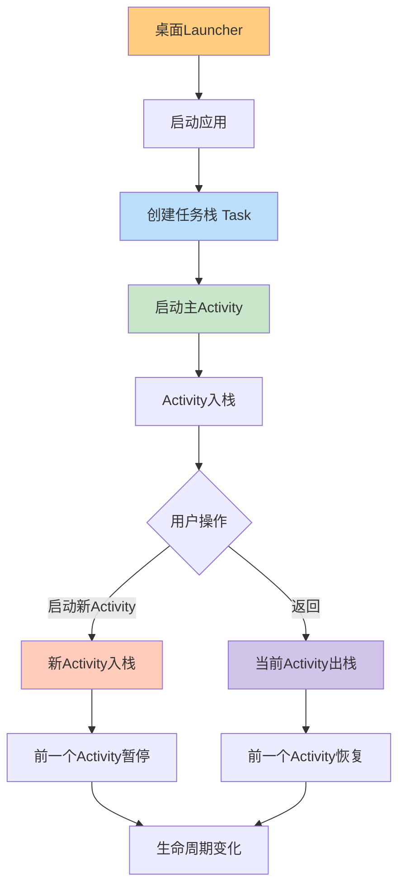

# Android Activity 生命周期、任务栈和启动器

## 🎯 核心概念图解



## 📱 Activity 生命周期全览

### 标准生命周期方法

```java
public class MainActivity extends AppCompatActivity {
    
    // 1. 创建Activity
    @Override
    protected void onCreate(Bundle savedInstanceState) {
        super.onCreate(savedInstanceState);
        setContentView(R.layout.activity_main);
        Log.d("Lifecycle", "onCreate");
    }
    
    // 2. Activity即将可见
    @Override
    protected void onStart() {
        super.onStart();
        Log.d("Lifecycle", "onStart");
    }
    
    // 3. Activity可交互
    @Override
    protected void onResume() {
        super.onResume();
        Log.d("Lifecycle", "onResume - 用户可交互");
    }
    
    // 4. Activity失去焦点（但还可见）
    @Override
    protected void onPause() {
        super.onPause();
        Log.d("Lifecycle", "onPause - 保存数据");
    }
    
    // 5. Activity完全不可见
    @Override
    protected void onStop() {
        super.onStop();
        Log.d("Lifecycle", "onStop");
    }
    
    // 6. Activity重新可见
    @Override
    protected void onRestart() {
        super.onRestart();
        Log.d("Lifecycle", "onRestart");
    }
    
    // 7. 销毁Activity
    @Override
    protected void onDestroy() {
        super.onDestroy();
        Log.d("Lifecycle", "onDestroy");
    }
}
```

## 📊 任务栈（Task Stack）详解

### 什么是任务栈？

```java
// 任务栈是 Activity 的后进先出（LIFO）栈结构
// 每个应用至少有一个任务栈
// 栈顶 Activity 是用户当前看到的界面

任务栈示例：
┌─────────────┐
│ Activity D  │ ← 栈顶（当前显示）
├─────────────┤
│ Activity C  │
├─────────────┤
│ Activity B  │
├─────────────┤
│ Activity A  │ ← 栈底（主界面）
└─────────────┘
```

### 入栈操作（启动新Activity）

```java
// 从 ActivityA 启动 ActivityB
public class ActivityA extends AppCompatActivity {
    
    public void startActivityB() {
        Intent intent = new Intent(this, ActivityB.class);
        startActivity(intent);
        
        // 当前栈状态变化：
        // 之前： [A] 
        // 之后： [A] → [A, B]  （B入栈）
        
        // 生命周期变化：
        // 1. A.onPause() 先执行
        // 2. B.onCreate() → onStart() → onResume()
        // 3. A.onStop() 后执行（如果B完全覆盖A）
    }
}
```

### 出栈操作（返回键）

```java
// 在 ActivityB 中按返回键
public class ActivityB extends AppCompatActivity {
    
    // 用户按返回键时：
    // 当前栈状态变化：
    // 之前： [A, B] 
    // 之后： [A]     （B出栈并被销毁）
    
    // 生命周期变化：
    // 1. B.onPause() 先执行
    // 2. A.onRestart() → onStart() → onResume()
    // 3. B.onStop() → onDestroy() 后执行
}
```

## 📱 Launcher（启动器）的处理

### 1. 从桌面启动应用

```java
// 当用户点击应用图标时：
1. Launcher发送 Intent：
   Intent {
       action: ACTION_MAIN
       category: CATEGORY_LAUNCHER
       component: 应用主Activity
   }

2. 系统检查：
   - 应用未运行：创建新任务栈，启动主Activity
   - 应用在后台：将已有任务栈调到前台
   - 应用在前台：无变化

3. 主Activity的启动模式影响行为：
   - standard/singleTop: 创建新实例
   - singleTask/singleInstance: 复用现有实例
```

### 2. 最近任务列表

```java
// 用户按"最近任务"键时：
1. 系统显示所有任务栈的快照
2. 用户选择任务：
   - 如果任务栈在后台，调到前台
   - 如果任务栈被销毁，重新创建

3. Activity的android:taskAffinity属性：
   // 指定Activity希望属于哪个任务栈
   <activity android:name=".ShareActivity"
       android:taskAffinity=".ShareTask">
   </activity>
```

## 🔧 Intent Flag 对任务栈的影响

### 常用 Flag

```kotlin
// 1. FLAG_ACTIVITY_NEW_TASK
// 在新任务栈中启动Activity
intent.flags = Intent.FLAG_ACTIVITY_NEW_TASK

// 2. FLAG_ACTIVITY_CLEAR_TOP
// 清除目标Activity之上的所有Activity
intent.flags = Intent.FLAG_ACTIVITY_CLEAR_TOP

// 3. FLAG_ACTIVITY_SINGLE_TOP
// 类似 singleTop 启动模式
intent.flags = Intent.FLAG_ACTIVITY_SINGLE_TOP

// 4. FLAG_ACTIVITY_CLEAR_TASK
// 清除整个任务栈，创建新实例
intent.flags = Intent.FLAG_ACTIVITY_CLEAR_TASK or Intent.FLAG_ACTIVITY_NEW_TASK

// 5. FLAG_ACTIVITY_REORDER_TO_FRONT
// 将已存在的Activity调到栈顶
intent.flags = Intent.FLAG_ACTIVITY_REORDER_TO_FRONT
```