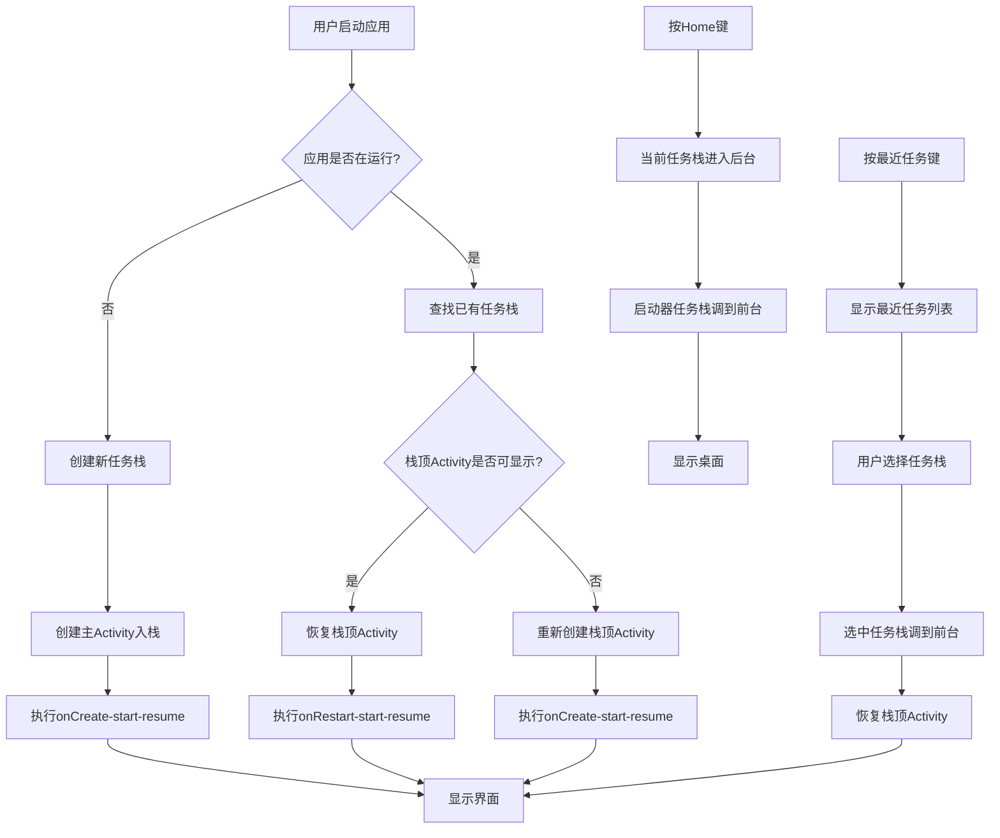

# Android 多任务栈深度解析

## 📊 核心概念回顾

### 1. 任务栈（Task）与返回栈（Back Stack）

```java
// 任务栈是包含多个Activity的容器
// 返回栈是任务栈内部的后进先出结构

// 系统维护一个全局的任务栈列表
TaskStackList {
    Task1: [A1, A2, A3]  // 应用A的任务栈
    Task2: [B1, B2]      // 应用B的任务栈
    Task3: [Launcher]    // 启动器任务栈
    Task4: [C1]          // 应用C的任务栈
}
```

## 🔄 完整场景分析

### 场景描述

```markdown
用户操作序列：
1. 启动应用A → 打开A1 → 打开A2
2. 按Home键回到桌面
3. 启动应用B → 打开B1 → 打开B2
4. 按Recent Apps（最近任务）切回应用A
5. 在A2中打开A3
6. 按Home键回到桌面
7. 从桌面重新启动应用B
```

## 📱 分步详解

### 步骤1：启动应用A

```java
// 用户点击应用A图标
Launcher发送Intent: ACTION_MAIN, CATEGORY_LAUNCHER

// 系统处理：
1. 检查应用A是否已有任务栈
   - 没有：创建新任务栈Task_A
2. 启动主Activity A1
3. 任务栈状态：
   ┌─────────────┐
   │ Task_A: [A1] │ ← 前台任务栈
   └─────────────┘

// 生命周期：
A1: onCreate → onStart → onResume
```

### 步骤2：在A1中打开A2

```java
// 在A1中执行：startActivity(A2)
1. A1调用onPause()
2. 系统创建A2实例
3. A2入栈到Task_A
4. A2: onCreate → onStart → onResume
5. A1: onStop()

// 任务栈状态：
┌──────────────┐
│ Task_A: [A1, A2] │ ← 栈顶是A2
└──────────────┘
```

### 步骤3：按Home键回到桌面

```java
// 用户按Home键
1. 当前前台任务栈Task_A进入后台
2. A2: onPause() → onStop()
3. 启动器任务栈（Launcher Task）调到前台
4. Launcher Activity: onRestart() → onStart() → onResume()

// 系统状态：
前台任务栈: Launcher Task [Home]
后台任务栈: 
  Task_A: [A1, A2] (状态: stopped)
```

### 步骤4：启动应用B

```java
// 用户点击应用B图标
1. 检查应用B是否已有任务栈
   - 没有：创建新任务栈Task_B
2. 启动主Activity B1
3. 任务栈状态变化：
   前台任务栈: Task_B [B1]
   后台任务栈: Task_A [A1, A2], Launcher Task [Home]

// 生命周期：
B1: onCreate → onStart → onResume
```

### 步骤5：在B1中打开B2

```java
// 在B1中执行：startActivity(B2)
1. B1: onPause()
2. B2: onCreate → onStart → onResume
3. B1: onStop()

// 任务栈状态：
前台任务栈: Task_B [B1, B2] ← 栈顶B2
后台任务栈: Task_A [A1, A2], Launcher Task [Home]
```

### 步骤6：按Recent Apps切回应用A

```java
// 用户点击最近任务中的应用A
1. 当前前台任务栈Task_B进入后台
   B2: onPause() → onStop()
2. 任务栈Task_A调到前台
3. 显示Task_A栈顶Activity A2
4. A2: onRestart() → onStart() → onResume()

// 系统状态：
前台任务栈: Task_A [A1, A2] ← A2恢复
后台任务栈: Task_B [B1, B2], Launcher Task [Home]

// 注意：A1仍保持在stopped状态
```

### 步骤7：在A2中打开A3

```java
// 在A2中执行：startActivity(A3)
1. A2: onPause()
2. A3: onCreate → onStart → onResume
3. A2: onStop()

// 任务栈状态变化：
前台任务栈: Task_A [A1, A2, A3] ← 栈顶A3
后台任务栈: Task_B [B1, B2], Launcher Task [Home]
```

### 步骤8：按Home键回到桌面

```java
// 用户按Home键
1. Task_A进入后台
   A3: onPause() → onStop()
2. Launcher Task调到前台
3. Launcher: onRestart() → onStart() → onResume()

// 系统状态：
前台任务栈: Launcher Task [Home]
后台任务栈: 
  Task_A: [A1, A2, A3] (stopped)
  Task_B: [B1, B2] (stopped)
```

### 步骤9：从桌面重新启动应用B

```java
// 用户再次点击应用B图标
// 关键：应用B已有任务栈Task_B在后台

1. 系统查找应用B的任务栈
   - 找到Task_B: [B1, B2]
2. 将Task_B调到前台
3. 显示Task_B栈顶Activity B2
4. B2: onRestart() → onStart() → onResume()

// 任务栈状态：
前台任务栈: Task_B [B1, B2] ← B2恢复
后台任务栈: Task_A [A1, A2, A3], Launcher Task [Home]

// 注意：B1仍保持在stopped状态
```

## 🎯 系统内部的决策逻辑

### 1. 系统如何选择显示哪个页面？

```java
// ActivityManagerService 中的决策逻辑
class ActivityManagerService {
    
    public ActivityRecord getTopRunningActivity() {
        // 1. 获取前台任务栈
        Task foregroundTask = getForegroundTask();
        
        // 2. 获取栈顶Activity
        ActivityRecord topActivity = foregroundTask.getTopActivity();
        
        // 3. 检查Activity是否可用
        if (topActivity != null && topActivity.isResumed()) {
            return topActivity;
        }
        
        // 4. 如果不可用，恢复它
        resumeTopActivity(foregroundTask);
    }
    
    public void startActivity(Intent intent) {
        // 解析Intent
        // 检查目标Activity的启动模式
        // 检查任务栈亲和性（taskAffinity）
        // 检查Intent Flag
        // 决定是创建新任务栈还是复用现有任务栈
        // 决定是否清除已有Activity
    }
}
```

### 2. 任务栈的管理数据结构

```java
// 系统内部的任务栈管理
class TaskStackManager {
    
    // 全局任务栈列表
    private List<Task> mTasks = new ArrayList<>();
    
    // 前台任务栈
    private Task mForegroundTask;
    
    // 最近任务列表
    private RecentTasks mRecentTasks;
    
    // 添加任务栈
    public void addTask(Task task) {
        mTasks.add(task);
        mRecentTasks.add(task);
    }
    
    // 切换任务栈到前台
    public void moveTaskToFront(Task task) {
        if (mForegroundTask != null) {
            // 当前前台任务栈进入后台
            mForegroundTask.moveToBack();
        }
        
        // 新任务栈调到前台
        task.moveToFront();
        mForegroundTask = task;
        
        // 恢复栈顶Activity
        task.resumeTopActivity();
    }
    
    // 获取任务栈
    public Task getTaskByAffinity(String affinity) {
        for (Task task : mTasks) {
            if (task.getAffinity().equals(affinity)) {
                return task;
            }
        }
        return null;
    }
}
```

## 📊 多任务栈状态表格

| 操作  | 前台任务栈       | 后台任务栈                      | 生命周期变化                                   |
| ----- | ---------------- | ------------------------------- | ---------------------------------------------- |
| 启动A | Task_A[A1]       | 无                              | A1: create-start-resume                        |
| A1→A2 | Task_A[A1,A2]    | 无                              | A1: pause-stop, A2: create-start-resume        |
| Home  | Launcher         | Task_A[A1,A2]                   | A2: pause-stop, Launcher: restart-start-resume |
| 启动B | Task_B[B1]       | Task_A[A1,A2]                   | B1: create-start-resume                        |
| B1→B2 | Task_B[B1,B2]    | Task_A[A1,A2]                   | B1: pause-stop, B2: create-start-resume        |
| 切回A | Task_A[A1,A2]    | Task_B[B1,B2]                   | B2: pause-stop, A2: restart-start-resume       |
| A2→A3 | Task_A[A1,A2,A3] | Task_B[B1,B2]                   | A2: pause-stop, A3: create-start-resume        |
| Home  | Launcher         | Task_A[A1,A2,A3], Task_B[B1,B2] | A3: pause-stop, Launcher: restart-start-resume |
| 重开B | Task_B[B1,B2]    | Task_A[A1,A2,A3]                | B2: restart-start-resume                       |

## 🔧 系统API层面的处理

### 1. ActivityManager 中的相关方法

```java
// 获取运行中的任务
ActivityManager am = (ActivityManager) getSystemService(Context.ACTIVITY_SERVICE);

// 获取最近任务列表
List<ActivityManager.AppTask> appTasks = am.getAppTasks();

// 获取运行中的任务信息
List<ActivityManager.RunningTaskInfo> runningTasks = 
    am.getRunningTasks(Integer.MAX_VALUE);

// 获取任务栈信息
for (ActivityManager.RunningTaskInfo taskInfo : runningTasks) {
    Log.d("TaskInfo", "任务ID: " + taskInfo.id);
    Log.d("TaskInfo", "栈ID: " + taskInfo.stackId);
    Log.d("TaskInfo", "任务数量: " + taskInfo.numActivities);
    Log.d("TaskInfo", "基Activity: " + taskInfo.baseActivity.getClassName());
    Log.d("TaskInfo", "顶Activity: " + taskInfo.topActivity.getClassName());
    
    // 任务栈中的Activity列表
    ComponentName componentName = taskInfo.topActivity;
}
```

### 2. 任务栈的生命周期回调

```kotlin
// Application中监听任务栈变化
class MyApplication : Application() {
    
    override fun onCreate() {
        super.onCreate()
        
        // 注册Activity生命周期回调
        registerActivityLifecycleCallbacks(object : ActivityLifecycleCallbacks {
            override fun onActivityCreated(activity: Activity, savedInstanceState: Bundle?) {
                Log.d("TaskLifecycle", "创建: ${activity.javaClass.simpleName}")
            }
            
            override fun onActivityStarted(activity: Activity) {
                Log.d("TaskLifecycle", "开始: ${activity.javaClass.simpleName}")
            }
            
            override fun onActivityResumed(activity: Activity) {
                Log.d("TaskLifecycle", "恢复: ${activity.javaClass.simpleName}")
                Log.d("TaskLifecycle", "任务ID: ${activity.taskId}")
                Log.d("TaskLifecycle", "是否前台: ${activity.isTaskRoot}")
            }
            
            override fun onActivityPaused(activity: Activity) {
                Log.d("TaskLifecycle", "暂停: ${activity.javaClass.simpleName}")
            }
            
            override fun onActivityStopped(activity: Activity) {
                Log.d("TaskLifecycle", "停止: ${activity.javaClass.simpleName}")
            }
            
            override fun onActivityDestroyed(activity: Activity) {
                Log.d("TaskLifecycle", "销毁: ${activity.javaClass.simpleName}")
            }
            
            override fun onActivitySaveInstanceState(activity: Activity, outState: Bundle) {
                Log.d("TaskLifecycle", "保存状态: ${activity.javaClass.simpleName}")
            }
        })
    }
}
```

## 📈 系统决策流程图



## 🔄 复杂的多任务场景

### 场景：跨应用启动Activity

```java
// 应用A启动应用B的某个Activity
// 假设应用B的Activity配置了taskAffinity

// 应用A的代码
Intent intent = new Intent(Intent.ACTION_VIEW);
intent.setComponent(new ComponentName("com.app.b", "com.app.b.ShareActivity"));
intent.setFlags(Intent.FLAG_ACTIVITY_NEW_TASK);
startActivity(intent);

// 系统处理：
1. 检查ShareActivity的taskAffinity
2. 查找匹配的任务栈
3. 如果找到，在对应任务栈中启动
4. 如果没找到，创建新任务栈
5. 任务栈可能被移到前台
```

### 场景：文档中心模式

```java
// Android 5.0+ 支持文档中心模式
// 每个文档在独立任务栈中打开

<activity android:name=".DocumentActivity"
    android:launchMode="standard"
    android:documentLaunchMode="intoExisting">
</activity>

// 系统处理：
// 每个文档会创建独立任务栈
// 在最近任务列表中显示为独立卡片
```

## ⚙️ 系统内存管理

### 1. 低内存时的任务栈处理

```java
// 当系统内存不足时
class ActivityManagerService {
    
    public void trimApplications() {
        // 1. 按LRU（最近最少使用）清理后台任务栈
        // 2. 清理顺序：最近最少使用的任务栈优先
        // 3. 清理内容：
        //    - 保存Activity状态（onSaveInstanceState）
        //    - 调用onDestroy()
        //    - 移除任务栈
        
        // 任务栈恢复时：
        // 1. 重新创建Activity
        // 2. 恢复保存的状态
        // 3. 调用onCreate()并传递保存的状态
    }
}
```

### 2. 任务栈持久化

```java
// 系统重启时恢复任务栈
class ActivityStackSupervisor {
    
    // 保存任务栈状态
    public void saveTaskStackState() {
        for (Task task : mTasks) {
            // 保存每个Activity的状态
            for (ActivityRecord record : task.getActivities()) {
                Bundle state = new Bundle();
                record.saveInstanceState(state);
                // 保存到磁盘
            }
        }
    }
    
    // 恢复任务栈
    public void restoreTaskStackState() {
        // 从磁盘读取保存的状态
        // 重新创建任务栈
        // 重新创建Activity并恢复状态
    }
}
```

## 🎯 最佳实践

### 1. 合理设计任务栈

```xml
<!-- AndroidManifest.xml -->
<application>
    <!-- 主Activity：singleTask -->
    <activity
        android:name=".MainActivity"
        android:launchMode="singleTask"
        android:alwaysRetainTaskState="true">
        <intent-filter>
            <action android:name="android.intent.action.MAIN" />
            <category android:name="android.intent.category.LAUNCHER" />
        </intent-filter>
    </activity>
    
    <!-- 普通Activity：standard -->
    <activity android:name=".DetailActivity" />
    
    <!-- 独立功能：singleInstance -->
    <activity
        android:name=".CameraActivity"
        android:launchMode="singleInstance" />
    
    <!-- 文档类Activity -->
    <activity
        android:name=".DocumentActivity"
        android:launchMode="standard"
        android:documentLaunchMode="intoExisting" />
</application>
```

### 2. 处理多任务场景

```kotlin
class BaseActivity : AppCompatActivity() {
    
    override fun onNewIntent(intent: Intent?) {
        super.onNewIntent(intent)
        // 当Activity被重新调用时处理
        Log.d("Task", "收到新Intent，任务栈可能被复用")
    }
    
    override fun onTaskReentered() {
        super.onTaskReentered()
        // 当任务栈重新进入前台时
        Log.d("Task", "任务栈重新进入前台")
    }
    
    override fun onTrimMemory(level: Int) {
        super.onTrimMemory(level)
        when (level) {
            ComponentCallbacks2.TRIM_MEMORY_RUNNING_CRITICAL -> {
                // 释放非关键资源
            }
            ComponentCallbacks2.TRIM_MEMORY_BACKGROUND -> {
                // 应用进入后台，释放更多资源
            }
        }
    }
}
```

## 🔧 调试工具

### 1. adb 命令查看任务栈

```bash
# 查看所有运行中的任务栈
adb shell dumpsys activity activities

# 查看特定包名的任务栈
adb shell dumpsys activity activities | grep "com.example"

# 查看最近任务列表
adb shell dumpsys activity recents

# 查看任务栈ID
adb shell dumpsys activity stacks

# 查看Activity记录
adb shell dumpsys activity a
```