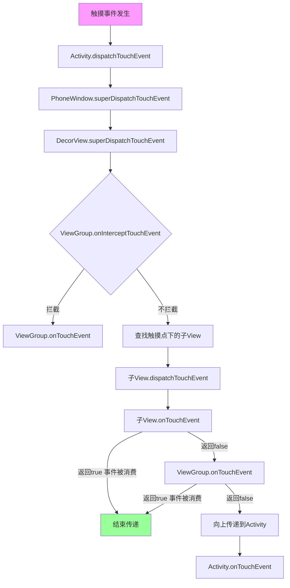

# UI布局的时间传递和处理流程

# Android 点击事件传递机制详解

## 一、事件传递的核心方向

**一句话总结**：**点击事件是从父布局传递到子View，事件处理是从子View传递到父布局。被消费后就不再向上传递。**

```java
// 事件传递的完整流程
事件产生 → Activity → Window → DecorView → 父ViewGroup → 子View
                                                                  ↓
事件处理：子View → 父ViewGroup → DecorView → Window → Activity
```

## 二、事件传递的两个阶段

### 1. **阶段1：事件分发（DOWNWARD 方向）**

```java
// 从上到下的传递过程
public class EventDispatchFlow {
    /*
    事件分发方向：父 → 子
    方法：dispatchTouchEvent()
    
    流程：
    Activity.dispatchTouchEvent() →
    Window.superDispatchTouchEvent() →
    DecorView.superDispatchTouchEvent() →
    ViewGroup.dispatchTouchEvent() →
    ViewGroup.onInterceptTouchEvent() →  // 决定是否拦截
    如果不拦截 → 子View.dispatchTouchEvent()
    */
}
```

**伪代码表示**：

```java
// ViewGroup 的 dispatchTouchEvent 简化逻辑
public boolean dispatchTouchEvent(MotionEvent ev) {
    boolean handled = false;
    
    // 1. 先问自己要不要拦截
    boolean intercepted = onInterceptTouchEvent(ev);
    
    if (!intercepted) {
        // 2. 不拦截，就分发给子View
        for (View child : children) {
            if (child.dispatchTouchEvent(ev)) {
                handled = true;  // 子View处理了
                break;
            }
        }
    }
    
    // 3. 如果子View没处理，自己处理
    if (!handled) {
        handled = onTouchEvent(ev);
    }
    
    return handled;
}
```

### 2. **阶段2：事件处理（UPWARD 方向）**

```java
// 从下到上的处理过程
public class EventHandleFlow {
    /*
    事件处理方向：子 → 父
    方法：onTouchEvent()
    
    流程：
    子View.onTouchEvent() → 如果返回false →
    父ViewGroup.onTouchEvent() → 如果返回false →
    ... 依次向上传递 →
    Activity.onTouchEvent()
    */
}
```

## 三、完整传递流程图



## 四、关键方法详解

### 1. **dispatchTouchEvent() - 事件分发方法**

```java
// Activity 中的 dispatchTouchEvent
@Override
public boolean dispatchTouchEvent(MotionEvent ev) {
    // 1. 事件最先到达这里
    Log.d("Event", "Activity dispatchTouchEvent");
    
    // 2. 交给 Window
    if (getWindow().superDispatchTouchEvent(ev)) {
        return true;  // 有View处理了
    }
    
    // 3. 没有View处理，Activity自己处理
    return onTouchEvent(ev);
}

// ViewGroup 中的 dispatchTouchEvent
@Override
public boolean dispatchTouchEvent(MotionEvent ev) {
    // 1. 检查是否需要拦截
    final boolean intercepted;
    if (ev.getActionMasked() == MotionEvent.ACTION_DOWN) {
        // 重置拦截状态
        resetTouchState();
    }
    
    intercepted = onInterceptTouchEvent(ev);
    
    // 2. 如果不拦截，分发给子View
    if (!intercepted) {
        // 找到触摸点下的子View
        View child = findChildUnderTouch(ev.getX(), ev.getY());
        if (child != null && child.dispatchTouchEvent(ev)) {
            return true;  // 子View处理了
        }
    }
    
    // 3. 子View没处理或自己拦截了，自己处理
    return onTouchEvent(ev);
}
```

### 2. **onInterceptTouchEvent() - 拦截方法**

```java
// ViewGroup 的拦截方法
@Override
public boolean onInterceptTouchEvent(MotionEvent ev) {
    // 默认返回 false，不拦截
    return false;
    
    // 如果需要拦截：
    // return true;  // 事件不会再传递给子View
}
```