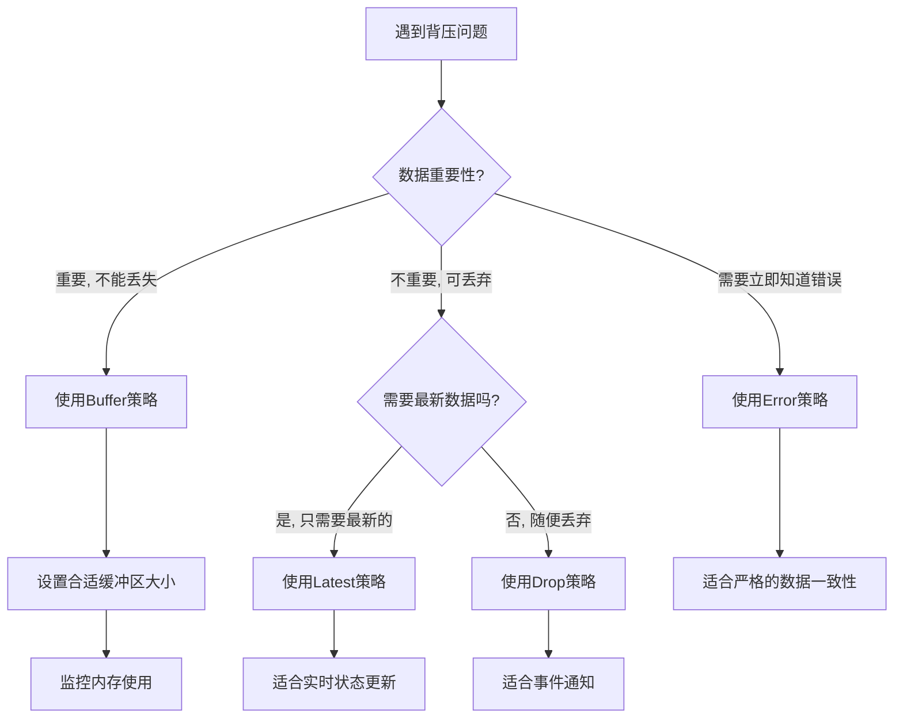

# 背压

# 背压（Backpressure）完全理解指南

## 一、背压的本质：用生活比喻

### 1. **水管模型（最容易理解的比喻）**

```markdown
上游水龙头（Observable）---水流（数据）--> 下游水杯（Observer）

✅ 正常情况：
水龙头：每秒滴1滴水
水杯：每秒能喝1滴水
→ 完美匹配，无背压

❌ 背压情况：
水龙头：每秒喷1000升水（高压水枪）
水杯：每秒只能喝1毫升
→ 水流速度 >> 喝水速度 → 水溢出！这就是背压
```

### 2. **快递仓库模型**

```markdown
快递公司(Observable) --每天发1000个包裹--> 你家门口(Observer)

正常：每天收10个包裹，能处理
背压：每天收1000个包裹，处理不完 → 包裹堆积如山 → 内存溢出！
```

## 二、背压的核心问题

### 1. **生产者 vs 消费者速度不匹配**

```java
// 生产者：快速发射数据
Observable.interval(1, TimeUnit.MILLISECONDS)  // 每秒1000个
    .map(i -> "数据" + i)  // 生产数据
    
    // 消费者：慢速处理
    .subscribe(data -> {
        Thread.sleep(100);  // 每秒只能处理10个
        System.out.println(data);
    });
```

**结果**：每秒产生1000个，只能处理10个，剩下990个积压！

### 2. **内存积压的数学计算**

```java
// 假设每个数据占用1KB内存
int dataPerSecond = 1000;  // 每秒产生1000个
int processPerSecond = 10; // 每秒处理10个
int backlogPerSecond = 990; // 每秒积压990个

// 1分钟后积压：
int oneMinuteBacklog = 990 * 60;  // 59400个
int memoryUsageKB = 59400;        // 58MB
// 很快就会OOM（内存溢出）！
```

## 三、背压的具体表现形式

### 1. **在代码中的表现**

```java
Observable.create(new ObservableOnSubscribe<Integer>() {
    @Override
    public void subscribe(ObservableEmitter<Integer> emitter) throws Exception {
        // 快速发射数据
        for (int i = 0; i < 1000000; i++) {
            emitter.onNext(i);
        }
        emitter.onComplete();
    }
})
.subscribe(new Observer<Integer>() {
    @Override
    public void onSubscribe(Disposable d) { }
    
    @Override
    public void onNext(Integer integer) {
        // 慢速处理
        try {
            Thread.sleep(10);  // 处理每个数据需要10ms
        } catch (InterruptedException e) {
            e.printStackTrace();
        }
    }
    
    @Override
    public void onError(Throwable e) {
        // 可能会看到：MissingBackpressureException
        System.out.println("背压错误：" + e.getMessage());
    }
    
    @Override
    public void onComplete() { }
});
```

**运行结果**：大概率会崩溃，报 `MissingBackpressureException`

## 四、RxJava 1.x 的背压问题

### 1. **Observable 不支持背压**

```java
// RxJava 1.x 的 Observable
rx.Observable.interval(1, TimeUnit.MILLISECONDS)
    .subscribe(new Subscriber<Long>() {
        @Override
        public void onNext(Long aLong) {
            // 没有内置的背压处理
            // 如果处理太慢，数据会在内部队列堆积
        }
        
        @Override
        public void onError(Throwable e) {
            // 当队列满了，可能会抛出 MissingBackpressureException
        }
        
        @Override
        public void onCompleted() { }
    });
```

**问题**：Observable 内部使用**无界队列**，数据会一直堆积直到 OOM。

## 五、RxJava 2.x/3.x 的解决方案

### 1. **引入 Flowable**

```java
// RxJava 2.x 将背压支持分离到 Flowable
Flowable.interval(1, TimeUnit.MILLISECONDS)
    .onBackpressureBuffer()  // 显式指定背压策略
    .subscribe(new Subscriber<Long>() {
        private Subscription subscription;
        
        @Override
        public void onSubscribe(Subscription s) {
            this.subscription = s;
            s.request(1);  // 手动请求第一个数据
        }
        
        @Override
        public void onNext(Long aLong) {
            // 处理数据
            processData(aLong);
            
            // 处理完后再请求下一个
            subscription.request(1);
        }
        
        @Override
        public void onError(Throwable t) { }
        
        @Override
        public void onComplete() { }
    });
```

### 2. **Observable vs Flowable 对比**

| 特性         | Observable         | Flowable           |
| ------------ | ------------------ | ------------------ |
| **背压支持** | ❌ 不支持           | ✅ 支持             |
| **适用场景** | 少量数据（≤1000）  | 大量数据           |
| **性能**     | 稍快（无背压开销） | 稍慢（有背压管理） |
| **操作符**   | 全部支持           | 大部分支持         |
| **内存使用** | 可能OOM            | 受控               |

## 六、背压的四种策略

### 1. **Buffer（缓冲）策略**

```java
// 1. 无限缓冲（危险）
Flowable.interval(1, TimeUnit.MILLISECONDS)
    .onBackpressureBuffer()  // 默认无界缓冲
    .subscribe(...);
    
// 2. 有界缓冲
Flowable.interval(1, TimeUnit.MILLISECONDS)
    .onBackpressureBuffer(
        1000,                 // 容量
        () -> System.out.println("缓冲满了！"),  // 满时回调
        BackpressureOverflowStrategy.ERROR  // 满时策略
    )
    .subscribe(...);
```

**策略选项**：

```java
enum BackpressureOverflowStrategy {
    ERROR,      // 抛出 MissingBackpressureException
    DROP_OLDEST, // 丢弃最老的
    DROP_LATEST  // 丢弃最新的
}
```

### 2. **Drop（丢弃）策略**

```java
// 丢弃无法处理的数据
Flowable.interval(1, TimeUnit.MILLISECONDS)
    .onBackpressureDrop(dropped -> {
        System.out.println("丢弃了: " + dropped);
    })
    .subscribe(...);
```

**工作原理**：

```markdown
生产者: 1 2 3 4 5 6 7 8 9 10 ...
消费者: 处理1 → 处理2 → 处理3
丢弃: 4 5 6 7 8 9 10 ...（因为消费者来不及处理）
```

### 3. **Latest（最新）策略**

```java
// 只保留最新的数据
Flowable.interval(1, TimeUnit.MILLISECONDS)
    .onBackpressureLatest()
    .subscribe(...);
```

**工作原理**：

```markdown
生产者: 1 2 3 4 5 6 7 8
消费者: 处理1（耗时）→ 处理8（跳过了2-7）
结果: 只处理了1和8，中间的数据被丢弃
```

### 4. **Error（错误）策略**

```java
// 背压时抛出错误
Flowable.interval(1, TimeUnit.MILLISECONDS)
    .onBackpressureError()
    .subscribe(
        data -> { /* 处理数据 */ },
        error -> {
            // 会收到 MissingBackpressureException
            System.out.println("背压错误: " + error);
        }
    );
```

## 七、实际应用示例

### 1. **场景：Android 按钮防抖**

```kotlin
// 没有背压处理 - 可能内存溢出
button.clicks()
    .throttleFirst(500, TimeUnit.MILLISECONDS)  // 防抖
    .flatMap { 
        // 每次点击发起网络请求
        api.getData().toObservable()
    }
    .subscribe { data ->
        updateUI(data)
    }

// 有背压处理 - 安全
button.clicks()
    .throttleFirst(500, TimeUnit.MILLISECONDS)
    .toFlowable(BackpressureStrategy.LATEST)  // 转换为Flowable
    .flatMap { 
        api.getData().toFlowable()
    }
    .onBackpressureDrop { droppedClick ->
        Log.d("Backpressure", "丢弃过快点击")
    }
    .subscribe { data ->
        updateUI(data)
    }
```

### 2. **场景：传感器数据处理**

```java
// 传感器数据可能非常快，需要背压处理
Flowable.create(emitter -> {
    SensorManager sensorManager = getSensorManager();
    Sensor sensor = sensorManager.getDefaultSensor(Sensor.TYPE_ACCELEROMETER);
    
    SensorEventListener listener = new SensorEventListener() {
        @Override
        public void onSensorChanged(SensorEvent event) {
            emitter.onNext(event.values);  // 可能每秒几百次
        }
        
        @Override
        public void onAccuracyChanged(Sensor sensor, int accuracy) { }
    };
    
    sensorManager.registerListener(listener, sensor, SensorManager.SENSOR_DELAY_FASTEST);
    
    emitter.setCancellable(() -> 
        sensorManager.unregisterListener(listener)
    );
}, BackpressureStrategy.DROP)  // 使用DROP策略
.sample(100, TimeUnit.MILLISECONDS)  // 采样，每秒只取10个
.subscribe(data -> {
    // 处理传感器数据
    processSensorData(data);
});
```

## 八、背压策略选择指南

### 决策流程图



### 策略选择表

| 场景         | 推荐策略       | 原因                     | 示例     |
| ------------ | -------------- | ------------------------ | -------- |
| **财务数据** | Buffer + Error | 数据不能丢失，错了要知道 | 交易记录 |
| **实时位置** | Latest         | 只需要最新位置           | GPS定位  |
| **点击事件** | Drop           | 快速点击只需响应一次     | 按钮防抖 |
| **日志记录** | Drop           | 丢失一些日志没关系       | 应用日志 |
| **视频流**   | Buffer(有界)   | 需要缓冲但避免OOM        | 实时视频 |
| **传感器**   | Latest/Drop    | 高频数据，只需最新       | 陀螺仪   |