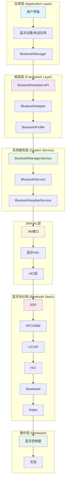
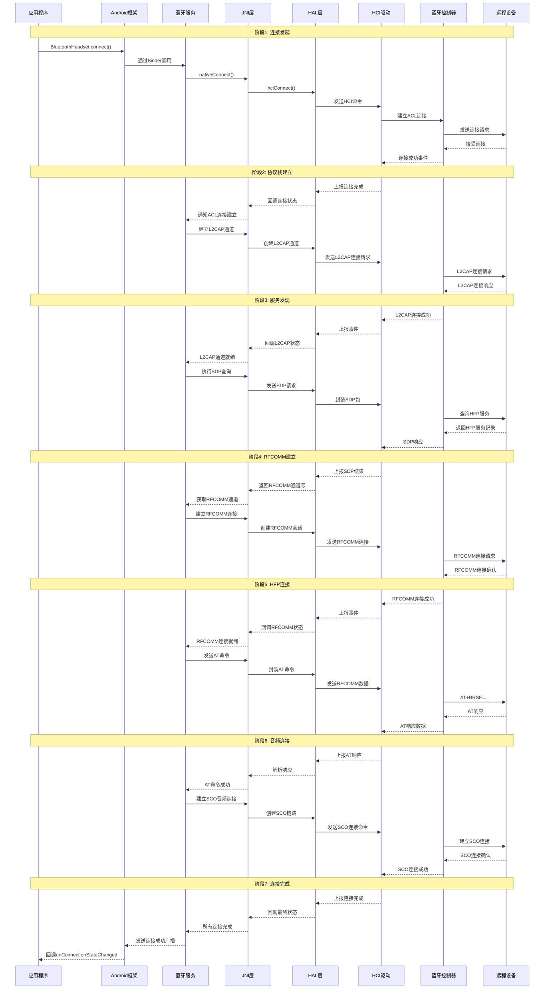
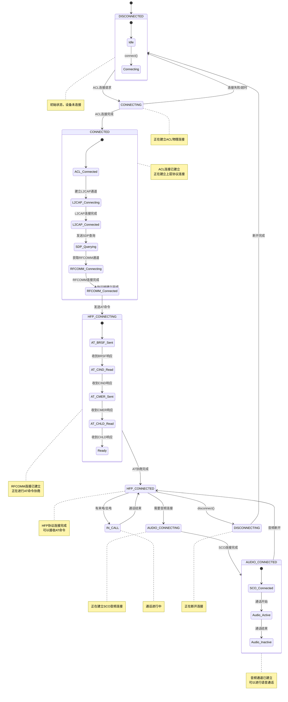

# 蓝牙HFP连接步骤

# 蓝牙HFP连接系统架构与协议栈分析

## 一、系统架构概览



## 二、详细连接步骤与协议栈分析

### 1. **完整连接流程图**



### 2. **协议栈各层详细分析**

```java
// 协议栈各层职责与处理流程
public class BluetoothProtocolStackAnalysis {
    
    /*
    📊 蓝牙协议栈分层架构与处理流程：
    
    ┌─────────────────────────────────────────────────────────────────────────┐
    │ 层次             │ 协议/接口          │ 功能                          │
    ├─────────────────┼──────────────────┼─────────────────────────────────┤
    │ 应用层          │ 应用程序           │ 用户界面，调用蓝牙API          │
    │ (Application)   │ Bluetooth API    │ 发起连接请求，处理回调          │
    ├─────────────────┼──────────────────┼─────────────────────────────────┤
    │ 框架层          │ BluetoothManager │ 管理蓝牙服务生命周期          │
    │ (Framework)     │ BluetoothAdapter │ 提供蓝牙API接口               │
    │                 │ BluetoothProfile │ 配置文件管理                   │
    ├─────────────────┼──────────────────┼─────────────────────────────────┤
    │ 系统服务层      │ BluetoothService  │ 系统蓝牙服务                  │
    │ (System Service)│ HeadsetService   │ 处理HFP连接逻辑               │
    ├─────────────────┼──────────────────┼─────────────────────────────────┤
    │ JNI层           │ com_android_     │ Java与C++的桥梁               │
    │ (JNI Layer)     │ bluetooth.cpp    │ 调用底层蓝牙栈                │
    ├─────────────────┼──────────────────┼─────────────────────────────────┤
    │ HAL层           │ bluetooth.default│ 硬件抽象层                    │
    │ (HAL)           │ bluetooth.so     │ 标准化硬件接口               │
    ├─────────────────┼──────────────────┼─────────────────────────────────┤
    │ 蓝牙协议栈      │ HCI驱动           │ 主机控制器接口               │
    │ (Bluetooth Stack)│ L2CAP           │ 逻辑链路控制与适配           │
    │                 │ RFCOMM           │ 串口仿真协议                 │
    │                 │ SDP              │ 服务发现协议                 │
    │                 │ AVDTP/AVCTP      │ 音视频分发/控制              │
    ├─────────────────┼──────────────────┼─────────────────────────────────┤
    │ 硬件层          │ 蓝牙控制器        │ 蓝牙芯片硬件                 │
    │ (Hardware)      │ 基带处理器        │ 调制解调，无线传输           │
    │                 │ 射频模块         │ 2.4GHz无线信号              │
    └─────────────────┴──────────────────┴─────────────────────────────────┘
    */
    
    class LayerByLayerAnalysis {
        
        /*
        1️⃣ 应用层 (Application Layer)
           --------------------------------------------------
           功能：
           - 提供用户界面
           - 调用Android蓝牙API
           - 处理连接状态回调
           - 管理连接生命周期
           
           关键类：
           - BluetoothHeadset
           - BluetoothDevice
           - BluetoothAdapter
           
           处理流程：
           1. 用户点击连接
           2. 调用 connect(BluetoothDevice)
           3. 注册 BroadcastReceiver
           4. 处理连接状态变化
           
           示例代码：
        */
        class ApplicationLayer {
            fun initiateConnection(device: BluetoothDevice) {
                // 获取BluetoothHeadset代理
                val bluetoothAdapter = BluetoothAdapter.getDefaultAdapter()
                val profileProxy = bluetoothAdapter.getProfileProxy(
                    context,
                    profileListener,
                    BluetoothProfile.HEADSET
                )
                
                // 发起连接
                (profileProxy as BluetoothHeadset).connect(device)
            }
            
            // 接收连接状态广播
            private val connectionReceiver = object : BroadcastReceiver() {
                override fun onReceive(context: Context, intent: Intent) {
                    when (intent.action) {
                        BluetoothHeadset.ACTION_CONNECTION_STATE_CHANGED -> {
                            val state = intent.getIntExtra(
                                BluetoothHeadset.EXTRA_STATE,
                                BluetoothHeadset.STATE_DISCONNECTED
                            )
                            handleConnectionState(state)
                        }
                    }
                }
            }
        }
        
        /*
        2️⃣ 框架层 (Framework Layer)
           --------------------------------------------------
           功能：
           - 提供蓝牙API接口
           - 管理Profile代理
           - 权限检查
           - 进程间通信
           
           关键类：
           - BluetoothManager
           - BluetoothAdapter
           - BluetoothProfile
           
           处理流程：
           1. 验证调用权限
           2. 获取BluetoothHeadset代理
           3. 通过Binder调用系统服务
           4. 返回结果给应用
           
           源码位置：
           - frameworks/base/core/java/android/bluetooth/
           - BluetoothHeadset.java
           - BluetoothAdapter.java
        */
        class FrameworkLayer {
            /*
            BluetoothHeadset.connect() 的实现路径：
            
            App调用 → BluetoothHeadset.connect() 
                     → BluetoothAdapter.getService() 
                     → IBluetoothHeadset.aidl 
                     → BluetoothHeadsetService
            */
        }
        
        /*
        3️⃣ 系统服务层 (System Service)
           --------------------------------------------------
           功能：
           - 管理蓝牙服务生命周期
           - 处理连接状态机
           - 协调多个Profile
           - 状态持久化
           
           关键类：
           - BluetoothManagerService
           - BluetoothHeadsetService
           - AdapterService
           
           处理流程：
           1. 接收Framework层的Binder调用
           2. 验证权限和状态
           3. 创建连接状态机
           4. 调用JNI接口
           5. 广播状态变化
           
           源码位置：
           - packages/apps/Bluetooth/src/com/android/bluetooth/
           - hfp/HeadsetStateMachine.java
           - btservice/AdapterService.java
        */
        class SystemServiceLayer {
            /*
            HeadsetStateMachine 状态机：
            
            DISCONNECTED → CONNECTING → CONNECTED → AUDIO_CONNECTING → AUDIO_CONNECTED
                   ↑          |            |              |                  |
                   └──────────┴────────────┴──────────────┴──────────────────┘
            */
            
            class HeadsetStateMachine {
                // 状态定义
                enum class State {
                    DISCONNECTED,
                    CONNECTING,
                    CONNECTED,
                    AUDIO_CONNECTING,
                    AUDIO_CONNECTED,
                    DISCONNECTING
                }
                
                // 事件处理
                fun processEvent(event: Event) {
                    when (currentState) {
                        State.DISCONNECTED -> handleDisconnected(event)
                        State.CONNECTING -> handleConnecting(event)
                        State.CONNECTED -> handleConnected(event)
                        State.AUDIO_CONNECTING -> handleAudioConnecting(event)
                        State.AUDIO_CONNECTED -> handleAudioConnected(event)
                        State.DISCONNECTING -> handleDisconnecting(event)
                    }
                }
            }
        }
        
        /*
        4️⃣ JNI层 (JNI Layer)
           --------------------------------------------------
           功能：
           - Java与C++的桥梁
           - 封装底层蓝牙栈调用
           - 回调Java层事件
           - 内存管理
           
           关键文件：
           - com_android_bluetooth_hfp.cpp
           - com_android_bluetooth_btservice_AdapterService.cpp
           
           处理流程：
           1. 接收Java层调用
           2. 转换为C++调用
           3. 调用HAL接口
           4. 处理异步回调
           5. 回调Java层
           
           源码位置：
           - packages/apps/Bluetooth/jni/
        */
        class JNILayer {
            /*
            JNI函数映射示例：
            
            Java方法：nativeConnect(address)
            ↓
            JNI函数：connectNative(JNIEnv* env, jobject obj, jstring address)
            ↓
            C++调用：sBluetoothHfpInterface->Connect(address)
            */
            
            // JNI函数示例
            extern "C" JNIEXPORT jboolean JNICALL
            Java_com_android_bluetooth_hfp_HeadsetNativeInterface_connectNative(
                JNIEnv* env, jobject obj, jstring address) {
                
                const char* tmp_addr = env->GetStringUTFChars(address, NULL);
                RawAddress bd_addr;
                RawAddress::FromString(tmp_addr, bd_addr);
                
                // 调用HAL接口
                bt_status_t status = sBluetoothHfpInterface->connect(bd_addr);
                
                env->ReleaseStringUTFChars(address, tmp_addr);
                return (status == BT_STATUS_SUCCESS) ? JNI_TRUE : JNI_FALSE;
            }
        }
        
        /*
        5️⃣ HAL层 (Hardware Abstraction Layer)
           --------------------------------------------------
           功能：
           - 标准化硬件接口
           - 协议栈与驱动之间的桥梁
           - 硬件适配
           - 电源管理
           
           接口定义：
           - hardware/libhardware/include/hardware/bluetooth.h
           - hardware/libhardware/include/hardware/bt_hf.h
           
           处理流程：
           1. 实现标准蓝牙HAL接口
           2. 调用底层HCI驱动
           3. 管理HCI命令/事件
           4. 处理数据包封装/解封装
           
           关键结构：
        */
        class HALLayer {
            // HAL接口结构
            typedef struct {
                size_t size;
                // 初始化
                bt_status_t (*init)(
                    bthh_callbacks_t* callbacks
                );
                
                // 连接设备
                bt_status_t (*connect)(
                    RawAddress* bd_addr
                );
                
                // 断开连接
                bt_status_t (*disconnect)(
                    RawAddress* bd_addr
                );
                
                // 音频连接
                bt_status_t (*connect_audio)(
                    RawAddress* bd_addr
                );
                
                // 断开音频
                bt_status_t (*disconnect_audio)(
                    RawAddress* bd_addr
                );
                
                // 发送AT命令
                bt_status_t (*at_response)(
                    RawAddress* bd_addr,
                    int response_code,
                    int error_code,
                    const char* response
                );
            } bthf_interface_t;
            
            // 回调接口
            typedef struct {
                size_t size;
                // 连接状态回调
                void (*connection_state_callback)(
                    RawAddress* bd_addr,
                    bthf_connection_state_t state
                );
                
                // 音频状态回调
                void (*audio_state_callback)(
                    RawAddress* bd_addr,
                    bthf_audio_state_t state
                );
                
                // 来电显示回调
                void (*call_indication_callback)(
                    RawAddress* bd_addr,
                    bthf_call_state_t call_state,
                    uint32_t number,
                    bthf_call_addrtype_t addr_type
                );
            } bthf_callbacks_t;
        }
        
        /*
        6️⃣ HCI层 (Host Controller Interface)
           --------------------------------------------------
           功能：
           - 主机与控制器之间的接口
           - 发送HCI命令
           - 接收HCI事件
           - 管理HCI数据包
           
           协议格式：
           
           HCI命令包：
           ┌─────────┬─────────┬───────────┬────────────┐
           │ 类型(1) │ OCF(2)  │ OGF(1)    │ 参数       │
           │ 0x01    │ 操作码  │ 操作组    │ 可变长度   │
           └─────────┴─────────┴───────────┴────────────┘
           
           HCI事件包：
           ┌─────────┬─────────┬────────────┐
           │ 类型(1) │ 事件码  │ 参数       │
           │ 0x04    │ 事件    │ 可变长度   │
           └─────────┴─────────┴────────────┘
           
           HCI数据包：
           ┌─────────┬─────────┬────────────┐
           │ 类型(1) │ 句柄    │ 数据       │
           │ 0x02    │ 连接句柄│ 可变长度   │
           └─────────┴─────────┴────────────┘
           
           关键HCI命令：
           - Create Connection (0x0405)
           - Accept Connection Request (0x0409)
           - Reject Connection Request (0x040A)
           - Setup Synchronous Connection (0x0428)
           - Accept Synchronous Connection (0x0429)
        */
        class HCILayer {
            
            // HCI命令定义
            class HCICommands {
                // 建立ACL连接
                fun createConnection(bdAddr: ByteArray): ByteArray {
                    val packet = ByteArray(13)
                    packet[0] = 0x01  // HCI命令包
                    packet[1] = 0x05  // OCF
                    packet[2] = 0x04  // OGF
                    packet[3] = 0x0D  // 参数长度
                    
                    // BD_ADDR
                    System.arraycopy(bdAddr, 0, packet, 4, 6)
                    
                    // 包类型：DM1
                    packet[10] = 0x00
                    packet[11] = 0x18
                    
                    // 角色：Master
                    packet[12] = 0x01
                    
                    return packet
                }
                
                // 创建SCO连接
                fun setupSynchronousConnection(handle: Int): ByteArray {
                    val packet = ByteArray(11)
                    packet[0] = 0x01  // HCI命令包
                    packet[1] = 0x28  // OCF
                    packet[2] = 0x04  // OGF
                    packet[3] = 0x07  // 参数长度
                    
                    // 连接句柄
                    packet[4] = (handle and 0xFF).toByte()
                    packet[5] = ((handle shr 8) and 0x0F).toByte()
                    
                    // 传输带宽
                    packet[6] = 0x00
                    packet[7] = 0x00
                    packet[8] = 0x00
                    
                    // 编码：CVSD
                    packet[9] = 0x00
                    packet[10] = 0x00
                    
                    return packet
                }
            }
            
            // HCI事件处理
            class HCIEventHandler {
                fun handleEvent(packet: ByteArray) {
                    when (packet[1].toInt() and 0xFF) {
                        // 连接完成事件
                        0x03 -> handleConnectionComplete(packet)
                        
                        // 连接请求事件
                        0x04 -> handleConnectionRequest(packet)
                        
                        // 断开连接完成事件
                        0x05 -> handleDisconnectionComplete(packet)
                        
                        // 命令完成事件
                        0x0E -> handleCommandComplete(packet)
                        
                        // 命令状态事件
                        0x0F -> handleCommandStatus(packet)
                        
                        // 同步连接完成事件
                        0x2C -> handleSynchronousConnectionComplete(packet)
                        
                        // 扩展查询响应
                        0x2F -> handleExtendedInquiryResult(packet)
                    }
                }
                
                private fun handleConnectionComplete(packet: ByteArray) {
                    val status = packet[3].toInt() and 0xFF
                    val handle = (packet[4].toInt() and 0xFF) or 
                                ((packet[5].toInt() and 0x0F) shl 8)
                    val bdAddr = packet.sliceArray(6..11)
                    
                    if (status == 0x00) {
                        Log.i("HCI", "连接建立成功，句柄: 0x${handle.toString(16)}")
                        // 通知上层L2CAP连接建立
                    } else {
                        Log.e("HCI", "连接失败，状态码: 0x${status.toString(16)}")
                    }
                }
            }
        }
        
        /*
        7️⃣ L2CAP层 (Logical Link Control and Adaptation Protocol)
           --------------------------------------------------
           功能：
           - 逻辑链路控制
           - 协议复用
           - 分段与重组
           - 流量控制
           
           PSM (Protocol/Service Multiplexer)：
           - SDP: 0x0001
           - RFCOMM: 0x0003
           - AVDTP: 0x0019
           - AVCTP: 0x0017
           
           连接建立流程：
           1. 发送L2CAP连接请求
           2. 接收L2CAP连接响应
           3. 配置L2CAP通道参数
           4. 通道建立完成
           
           数据包格式：
           ┌─────────┬─────────┬─────────┬────────────┐
           │ 长度(2) │ CID(2)  │ 信息    │ 数据       │
           │ 总长度  │ 通道ID  │ 可选的  │ 上层数据   │
           └─────────┴─────────┴─────────┴────────────┘
        */
        class L2CAPLayer {
            
            // L2CAP连接请求
            fun sendConnectionRequest(psm: Int, sourceCID: Int): ByteArray {
                val packet = ByteArray(12)
                
                // L2CAP头
                packet[0] = 0x08  // 长度低字节
                packet[1] = 0x00  // 长度高字节
                packet[2] = 0x01  // CID低字节 (信令通道)
                packet[3] = 0x00  // CID高字节
                
                // 信令命令
                packet[4] = 0x02  // 连接请求
                packet[5] = 0x00  // 标识符
                packet[6] = 0x08  // 长度
                
                // PSM
                packet[7] = (psm and 0xFF).toByte()
                packet[8] = ((psm shr 8) and 0xFF).toByte()
                
                // 源CID
                packet[9] = (sourceCID and 0xFF).toByte()
                packet[10] = ((sourceCID shr 8) and 0xFF).toByte()
                
                return packet
            }
            
            // 处理L2CAP数据包
            fun processL2CAPPacket(packet: ByteArray) {
                val length = ((packet[1].toInt() and 0xFF) shl 8) or 
                            (packet[0].toInt() and 0xFF)
                val cid = ((packet[3].toInt() and 0xFF) shl 8) or 
                         (packet[2].toInt() and 0xFF)
                
                when (cid) {
                    0x0001 -> {  // 信令通道
                        processSignalingChannel(packet.sliceArray(4 until packet.size))
                    }
                    0x0003 -> {  // RFCOMM通道
                        processRFCOMMData(packet.sliceArray(4 until packet.size))
                    }
                    0x0004 -> {  // SDP通道
                        processSDPData(packet.sliceArray(4 until packet.size))
                    }
                    else -> {
                        // 其他通道
                    }
                }
            }
        }
        
        /*
        8️⃣ RFCOMM层 (Radio Frequency Communication Protocol)
           --------------------------------------------------
           功能：
           - 串口仿真
           - 多路复用
           - 流量控制
           - 错误检测
           
           数据帧格式：
           
           基本帧：
           ┌─────────┬─────────┬─────────┬─────────┬────────────┐
           │ 地址(1) │ 控制(1) │ 长度(1) │ 信息    │ FCS(1)     │
           │ EA/C/R  │ PF/UIH  │ EA/LF   │ 数据    │ 校验和     │
           └─────────┴─────────┴─────────┴─────────┴────────────┘
           
           多路复用控制命令：
           - SABM: 建立异步平衡模式
           - UA: 无编号确认
           - DM: 断开模式
           - DISC: 断开连接
           
           DLCI (Data Link Connection Identifier):
           - 服务器通道: 0-30的偶数
           - 客户端通道: 1-31的奇数
        */
        class RFCOMMLayer {
            
            // RFCOMM会话建立
            fun establishSession(dlci: Int): ByteArray {
                val frame = ByteArray(6)
                
                // 地址字段
                frame[0] = 0x03  // EA=1, C/R=1, DLCI=dlci
                if (dlci < 2) {
                    frame[0] = (frame[0].toInt() or (dlci shl 2)).toByte()
                }
                
                // 控制字段
                frame[1] = 0x3F  // UIH帧，PF=1
                
                // 长度字段
                frame[2] = 0x00  // 长度=0
                
                // FCS字段
                frame[3] = calculateFCS(frame, 0, 3)
                
                return frame
            }
            
            // RFCOMM数据发送
            fun sendData(dlci: Int, data: ByteArray): ByteArray {
                val frame = ByteArray(5 + data.size)
                
                // 地址字段
                frame[0] = 0x01  // EA=1, C/R=0, DLCI=dlci
                if (dlci < 2) {
                    frame[0] = (frame[0].toInt() or (dlci shl 2)).toByte()
                }
                
                // 控制字段
                frame[1] = 0xEF  // UIH帧，PF=0
                
                // 长度字段
                val length = data.size
                if (length <= 127) {
                    frame[2] = (length shl 1 or 0x01).toByte()  // EA=1
                } else {
                    frame[2] = (length and 0x7F).toByte()  // 低7位
                    frame[3] = ((length shr 7) and 0xFF).toByte()  // 高8位
                }
                
                // 数据
                System.arraycopy(data, 0, frame, 4, data.size)
                
                // FCS
                frame[frame.size - 1] = calculateFCS(frame, 0, frame.size - 1)
                
                return frame
            }
            
            private fun calculateFCS(data: ByteArray, start: Int, end: Int): Byte {
                var fcs: Byte = 0
                for (i in start until end) {
                    fcs = fcs.xor(data[i])
                }
                return fcs
            }
        }
        
        /*
        9️⃣ SDP层 (Service Discovery Protocol)
           --------------------------------------------------
           功能：
           - 服务发现
           - 服务属性查询
           - 服务注册
           - 服务浏览
           
           SDP协议数据单元：
           ┌─────────┬─────────┬─────────┬────────────┐
           │ PDU ID  │ 事务ID  │ 参数长度 │ 参数      │
           │ 1字节   │ 2字节   │ 2字节   │ 变长      │
           └─────────┴─────────┴─────────┴────────────┘
           
           SDP事务：
           - SDP_ServiceSearchRequest
           - SDP_ServiceSearchResponse
           - SDP_ServiceAttributeRequest
           - SDP_ServiceAttributeResponse
           
           HFP服务记录：
           - ServiceClassIDList: Headset Audio Gateway
           - ProtocolDescriptorList: L2CAP, RFCOMM
           - ServiceName: "Hands-Free"
           - BluetoothProfileDescriptorList
        */
        class SDPLayer {
            
            // SDP服务搜索请求
            fun createServiceSearchRequest(serviceUUID: ByteArray): ByteArray {
                val packet = ByteArray(20)
                var offset = 0
                
                // PDU ID
                packet[offset++] = 0x02  // ServiceSearchRequest
                
                // 事务ID
                packet[offset++] = 0x00
                packet[offset++] = 0x01
                
                // 参数长度
                packet[offset++] = 0x00
                packet[offset++] = 0x0D
                
                // ServiceSearchPattern
                packet[offset++] = 0x35  // 数据元素序列
                packet[offset++] = 0x06  // 长度
                packet[offset++] = 0x19  // UUID
                packet[offset++] = 0x11  // HFP UUID
                packet[offset++] = 0x1E
                packet[offset] = 0x00.toByte()  // 继续...
                
                // 最大服务记录数
                packet[++offset] = 0x00
                packet[++offset] = 0x0A
                
                // 继续标识符
                packet[++offset] = 0x00
                
                return packet
            }
            
            // 解析HFP服务记录
            fun parseHFPServiceRecord(response: ByteArray): HFPServiceRecord? {
                val record = HFPServiceRecord()
                
                var offset = 0
                while (offset < response.size) {
                    val dataElementType = response[offset++].toInt() and 0xFF
                    val header = dataElementType and 0xF8
                    val sizeIndex = dataElementType and 0x07
                    
                    when (header) {
                        0x08 -> {  // 无符号整数
                            val value = parseUnsignedInt(response, offset, sizeIndex)
                            offset += getSizeBytes(sizeIndex)
                            // 处理无符号整数
                        }
                        0x10 -> {  // 有符号整数
                            val value = parseSignedInt(response, offset, sizeIndex)
                            offset += getSizeBytes(sizeIndex)
                            // 处理有符号整数
                        }
                        0x20 -> {  // UUID
                            val uuid = parseUUID(response, offset, sizeIndex)
                            offset += getSizeBytes(sizeIndex)
                            if (uuid == UUID_HFP) {
                                record.serviceClassID = uuid
                            }
                        }
                        0x30 -> {  // 字符串
                            val str = parseString(response, offset, sizeIndex)
                            offset += getSizeBytes(sizeIndex)
                            if (str.contains("Hands-Free")) {
                                record.serviceName = str
                            }
                        }
                        0x35 -> {  // 序列
                            val length = parseLength(response, offset, sizeIndex)
                            offset += getSizeBytes(sizeIndex)
                            val sequenceData = response.sliceArray(offset until offset + length)
                            parseSequence(sequenceData, record)
                            offset += length
                        }
                        else -> {
                            // 跳过未知类型
                            offset += getSizeBytes(sizeIndex)
                        }
                    }
                }
                
                return record
            }
            
            data class HFPServiceRecord(
                var serviceClassID: ByteArray? = null,
                var protocolDescriptorList: List<ProtocolDescriptor> = emptyList(),
                var serviceName: String? = null,
                var rfcommChannel: Int? = null
            )
            
            data class ProtocolDescriptor(
                val protocol: ByteArray,
                val parameters: Map<String, Any> = emptyMap()
            )
        }
    }
    
    /*
    9️⃣ 物理层与无线传输
       --------------------------------------------------
       无线连接建立过程：
       
       1. 查询 (Inquiry)：
          - 主设备发送查询包
          - 从设备响应查询
          - 获取设备地址和时钟
       
       2. 寻呼 (Page)：
          - 主设备发送寻呼请求
          - 从设备响应寻呼
          - 建立ACL连接
       
       3. 链路建立：
          - 交换LMP (Link Manager Protocol) 消息
          - 鉴权和加密
          - 建立逻辑传输
       
       4. 连接参数更新：
          - 协商连接参数
          - 设置呼吸模式
          - 调整发射功率
       
       蓝牙物理信道：
       - 79个RF信道 (2.402-2.480 GHz)
       - 1 MHz间隔
       - 跳频扩频 (FHSS)
       - 时分双工 (TDD)
       
       调制方式：
       - Basic Rate: GFSK
       - Enhanced Data Rate: π/4-DQPSK, 8DPSK
       - Low Energy: GFSK
    */
    class PhysicalLayer {
        
        // 查询过程
        fun performInquiry(): List<BluetoothDevice> {
            val devices = mutableListOf<BluetoothDevice>()
            
            // 发送查询命令
            sendHCICommand(HCICommands.inquiry())
            
            // 接收查询结果
            val results = receiveInquiryResults()
            
            results.forEach { result ->
                val device = BluetoothDevice(
                    address = extractAddress(result),
                    name = extractName(result),
                    rssi = extractRSSI(result)
                )
                devices.add(device)
            }
            
            return devices
        }
        
        // 寻呼过程
        fun performPaging(address: ByteArray): Boolean {
            // 发送寻呼命令
            val pageCommand = HCICommands.createConnection(address)
            sendHCICommand(pageCommand)
            
            // 等待连接完成事件
            val event = waitForHCIEvent(0x03, 10000)  // 连接完成事件
            
            return if (event != null) {
                val status = event[3].toInt() and 0xFF
                status == 0x00  // 成功
            } else {
                false
            }
        }
        
        // 连接参数更新
        fun updateConnectionParameters(
            handle: Int,
            intervalMin: Int,
            intervalMax: Int,
            latency: Int,
            timeout: Int
        ): Boolean {
            val command = ByteArray(14)
            command[0] = 0x01  // HCI命令包
            command[1] = 0x13  // OCF
            command[2] = 0x04  // OGF
            command[3] = 0x0A  // 参数长度
            
            // 连接句柄
            command[4] = (handle and 0xFF).toByte()
            command[5] = ((handle shr 8) and 0x0F).toByte()
            
            // 连接间隔最小值
            command[6] = (intervalMin and 0xFF).toByte()
            command[7] = ((intervalMin shr 8) and 0xFF).toByte()
            
            // 连接间隔最大值
            command[8] = (intervalMax and 0xFF).toByte()
            command[9] = ((intervalMax shr 8) and 0xFF).toByte()
            
            // 从机延迟
            command[10] = (latency and 0xFF).toByte()
            command[11] = ((latency shr 8) and 0xFF).toByte()
            
            // 监控超时
            command[12] = (timeout and 0xFF).toByte()
            command[13] = ((timeout shr 8) and 0xFF).toByte()
            
            sendHCICommand(command)
            
            val event = waitForHCIEvent(0x0E, 5000)  // 命令完成事件
            
            return if (event != null) {
                val status = event[3].toInt() and 0xFF
                status == 0x00
            } else {
                false
            }
        }
    }
}
```

### 3. **HFP连接状态机**



### 4. **数据包在协议栈中的流动**

```java
// 数据包在协议栈各层的封装过程
public class ProtocolStackDataFlow {
    
    /*
    📦 数据包在协议栈中的封装流程：
    
    应用层发送AT命令 "AT+BRSF=..." 的完整流程：
    
    1. 应用层 (Application)
       ↓
       原始数据: "AT+BRSF=..."
    
    2. RFCOMM层 (串口仿真)
       ↓
       RFCOMM帧: 
       ┌─────┬─────┬─────┬─────────────┬─────┐
       │地址 │控制 │长度 │"AT+BRSF=..."│ FCS │
       │1字节│1字节│1字节│  N字节      │1字节│
       └─────┴─────┴─────┴─────────────┴─────┘
       RFCOMM头增加: 3字节
    
    3. L2CAP层 (逻辑链路)
       ↓
       L2CAP帧:
       ┌─────┬─────┬─────────────────────┐
       │长度 │CID  │ RFCOMM帧            │
       │2字节│2字节│ (N+3)字节           │
       └─────┴─────┴─────────────────────┘
       L2CAP头增加: 4字节
    
    4. HCI层 (主机控制器接口)
       ↓
       HCI ACL数据包:
       ┌─────┬─────┬─────────┬─────────────┐
       │类型 │句柄 │PB/BC标志│ L2CAP帧      │
       │1字节│2字节│2字节    │ (N+7)字节    │
       └─────┴─────┴─────────┴─────────────┘
       HCI头增加: 4字节
    
    5. 蓝牙控制器 (硬件)
       ↓
       基带包:
       ┌─────┬─────┬─────┬───────────────┐
       │前导 │访问 │包头 │ HCI ACL包     │
       │1字节│4字节│2字节│ (N+11)字节    │
       └─────┴─────┴─────┴───────────────┘
       基带头增加: 7字节
    
    6. 射频层 (物理层)
       ↓
       无线信号: 2.4GHz调制信号
    
    📊 总封装开销: 3+4+4+7 = 18字节
    原始数据: 12字节 ("AT+BRSF=...")
    最终包大小: 12 + 18 = 30字节
    */
    
    class PacketEncapsulation {
        
        // 应用层数据
        fun createATCommand(command: String): ByteArray {
            return "$command\r".toByteArray(Charsets.UTF_8)
        }
        
        // RFCOMM封装
        fun encapsulateRFCOMM(data: ByteArray, dlci: Int): ByteArray {
            val frame = ByteArray(4 + data.size + 1)  // 地址+控制+长度+数据+FCS
            
            // 地址字段 (EA=1, C/R=1, DLCI)
            frame[0] = (0x01 or (dlci shl 2)).toByte()
            
            // 控制字段 (UIH帧, PF=1)
            frame[1] = 0xEF.toByte()
            
            // 长度字段
            if (data.size <= 127) {
                frame[2] = ((data.size shl 1) or 0x01).toByte()  // EA=1
            } else {
                frame[2] = (data.size and 0x7F).toByte()
                frame[3] = ((data.size shr 7) and 0xFF).toByte()
            }
            
            // 数据
            System.arraycopy(data, 0, frame, 3, data.size)
            
            // FCS (帧校验序列)
            frame[frame.size - 1] = calculateFCS(frame, 0, frame.size - 1)
            
            return frame
        }
        
        // L2CAP封装
        fun encapsulateL2CAP(rfcommData: ByteArray, cid: Int): ByteArray {
            val packet = ByteArray(4 + rfcommData.size)
            
            // 长度 (不包括L2CAP头)
            val length = rfcommData.size
            packet[0] = (length and 0xFF).toByte()
            packet[1] = ((length shr 8) and 0xFF).toByte()
            
            // 通道ID
            packet[2] = (cid and 0xFF).toByte()
            packet[3] = ((cid shr 8) and 0xFF).toByte()
            
            // 数据
            System.arraycopy(rfcommData, 0, packet, 4, rfcommData.size)
            
            return packet
        }
        
        // HCI ACL数据封装
        fun encapsulateHCIACL(l2capData: ByteArray, connectionHandle: Int): ByteArray {
            val packet = ByteArray(4 + l2capData.size)
            
            // HCI ACL数据包头
            packet[0] = 0x02  // HCI ACL数据包
            
            // 连接句柄 (低12位) + PB标志 (bits 12-13) + BC标志 (bits 14-15)
            val handleAndFlags = connectionHandle and 0x0FFF
            packet[1] = (handleAndFlags and 0xFF).toByte()
            packet[2] = (((handleAndFlags shr 8) and 0x0F) or 0x20).toByte()  // PB=00, BC=00
            
            // 数据总长度
            val dataLength = l2capData.size
            packet[3] = (dataLength and 0xFF).toByte()
            packet[4] = ((dataLength shr 8) and 0xFF).toByte()
            
            // 数据
            System.arraycopy(l2capData, 0, packet, 5, l2capData.size)
            
            return packet
        }
        
        // 基带封装
        fun encapsulateBaseband(hciData: ByteArray, ltAddr: Int, packetType: Int): ByteArray {
            val packet = ByteArray(10 + hciData.size)
            var offset = 0
            
            // 前导码 (10101010 或 01010101)
            packet[offset++] = 0xAA.toByte()  // 非调制前导码
            
            // 访问码
            val accessCode = calculateAccessCode(ltAddr)
            System.arraycopy(accessCode, 0, packet, offset, 4)
            offset += 4
            
            // 包头
            packet[offset++] = ((ltAddr and 0x7F) or ((packetType shl 7) and 0xFF)).toByte()
            
            // 头校验
            packet[offset++] = calculateHeaderChecksum(packet, 5, 8)
            
            // HCI数据
            System.arraycopy(hciData, 0, packet, offset, hciData.size)
            
            return packet
        }
        
        // 计算FCS
        private fun calculateFCS(data: ByteArray, start: Int, end: Int): Byte {
            var fcs: Byte = 0
            for (i in start until end) {
                fcs = fcs.xor(data[i])
            }
            return fcs
        }
        
        // 计算访问码
        private fun calculateAccessCode(ltAddr: Int): ByteArray {
            // 简化实现，实际更复杂
            val accessCode = ByteArray(4)
            for (i in 0..3) {
                accessCode[i] = ((ltAddr shr (i * 8)) and 0xFF).toByte()
            }
            return accessCode
        }
        
        // 包头校验
        private fun calculateHeaderChecksum(header: ByteArray, start: Int, end: Int): Byte {
            var checksum: Byte = 0
            for (i in start until end) {
                checksum = checksum.xor(header[i])
            }
            return checksum
        }
    }
    
    // 完整的数据发送流程
    class DataTransmissionFlow {
        
        fun sendATCommandToDevice(command: String, device: BluetoothDevice) {
            Log.d("ProtocolStack", "开始发送AT命令: $command")
            
            // 1. 应用层：创建AT命令
            val atCommand = createATCommand(command)
            Log.d("ProtocolStack", "应用层数据: ${atCommand.size} 字节")
            
            // 2. RFCOMM层封装
            val rfcommFrame = encapsulateRFCOMM(atCommand, 2)  // DLCI=2
            Log.d("ProtocolStack", "RFCOMM帧: ${rfcommFrame.size} 字节")
            
            // 3. L2CAP层封装
            val l2capPacket = encapsulateL2CAP(rfcommFrame, 0x0040)  // RFCOMM CID
            Log.d("ProtocolStack", "L2CAP包: ${l2capPacket.size} 字节")
            
            // 4. HCI层封装
            val hciPacket = encapsulateHCIACL(l2capPacket, 0x0200)  // 连接句柄
            Log.d("ProtocolStack", "HCI ACL包: ${hciPacket.size} 字节")
            
            // 5. 发送到蓝牙控制器
            sendToBluetoothController(hciPacket)
            
            Log.d("ProtocolStack", "数据发送完成，总大小: ${hciPacket.size} 字节")
        }
        
        // 接收数据流程
        fun receiveDataFromController(hciPacket: ByteArray) {
            Log.d("ProtocolStack", "接收到HCI包: ${hciPacket.size} 字节")
            
            // 1. 解析HCI包头
            val packetType = hciPacket[0].toInt() and 0xFF
            val connectionHandle = ((hciPacket[2].toInt() and 0x0F) shl 8) or 
                                   (hciPacket[1].toInt() and 0xFF)
            val dataLength = ((hciPacket[4].toInt() and 0xFF) shl 8) or 
                             (hciPacket[3].toInt() and 0xFF)
            
            Log.d("ProtocolStack", "包类型: 0x${packetType.toString(16)}, " +
                  "连接句柄: 0x${connectionHandle.toString(16)}, " +
                  "数据长度: $dataLength")
            
            if (packetType != 0x02) {  // 不是ACL数据包
                Log.w("ProtocolStack", "非ACL数据包，忽略")
                return
            }
            
            // 2. 提取L2CAP数据
            val l2capData = ByteArray(dataLength)
            System.arraycopy(hciPacket, 5, l2capData, 0, dataLength)
            
            // 3. 解析L2CAP头
            val l2capLength = ((l2capData[1].toInt() and 0xFF) shl 8) or 
                              (l2capData[0].toInt() and 0xFF)
            val cid = ((l2capData[3].toInt() and 0xFF) shl 8) or 
                      (l2capData[2].toInt() and 0xFF)
            
            Log.d("ProtocolStack", "L2CAP长度: $l2capLength, CID: 0x${cid.toString(16)}")
            
            // 4. 根据CID分发到不同协议
            when (cid) {
                0x0001 -> {  // 信令通道
                    processSignalingChannel(l2capData, 4)
                }
                0x0003 -> {  // RFCOMM通道
                    processRFCOMMChannel(l2capData, 4)
                }
                0x0004 -> {  // SDP通道
                    processSDPChannel(l2capData, 4)
                }
                0x0008 -> {  // 服务发现通道
                    processServiceDiscovery(l2capData, 4)
                }
                else -> {
                    Log.w("ProtocolStack", "未知CID: 0x${cid.toString(16)}")
                }
            }
        }
        
        private fun processRFCOMMChannel(data: ByteArray, offset: Int) {
            // 解析RFCOMM帧
            val address = data[offset].toInt() and 0xFF
            val control = data[offset + 1].toInt() and 0xFF
            val lengthField = data[offset + 2].toInt() and 0xFF
            
            val ea = (address and 0x01) != 0
            val cr = (address and 0x02) != 0
            val dlci = (address shr 2) and 0x3F
            
            val pf = (control and 0x10) != 0
            val frameType = control and 0xEF
            
            var length = 0
            var dataOffset = offset + 3
            
            if (ea) {  // 长度字段为1字节
                length = (lengthField shr 1) and 0x7F
            } else {  // 长度字段为2字节
                length = ((data[offset + 3].toInt() and 0xFF) shl 7) or 
                         (lengthField and 0x7F)
                dataOffset++
            }
            
            Log.d("ProtocolStack", "RFCOMM帧: DLCI=$dlci, CR=$cr, PF=$pf, 长度=$length")
            
            // 提取RFCOMM数据
            val rfcommData = ByteArray(length)
            System.arraycopy(data, dataOffset, rfcommData, 0, length)
            
            // 解析AT命令
            val atCommand = String(rfcommData, Charsets.UTF_8).trim()
            Log.d("ProtocolStack", "接收到AT命令: $atCommand")
            
            // 处理AT命令
            processATCommand(atCommand)
        }
        
        private fun processATCommand(command: String) {
            when {
                command.startsWith("AT+BRSF=") -> {
                    // 处理BRSF命令
                    val hfFeatures = command.substringAfter("=").toIntOrNull() ?: 0
                    Log.d("ProtocolStack", "HF支持特性: 0x${hfFeatures.toString(16)}")
                    
                    // 发送响应
                    sendResponse("+BRSF: ${getAGFeatures()}")
                    sendResponse("OK")
                }
                command == "AT+CIND=?" -> {
                    // 发送支持的指示器列表
                    sendResponse("+CIND: (\"service\",(0,1)),(\"call\",(0,1)),(\"callsetup\",(0-3))")
                    sendResponse("OK")
                }
                command == "AT+CIND?" -> {
                    // 查询指示器状态
                    sendResponse("+CIND: 1,1,0")
                    sendResponse("OK")
                }
                command.startsWith("AT+CMER=") -> {
                    // 设置事件报告
                    sendResponse("OK")
                }
                else -> {
                    Log.w("ProtocolStack", "未知AT命令: $command")
                    sendResponse("ERROR")
                }
            }
        }
        
        private fun sendResponse(response: String) {
            // 反向封装并发送响应
            val responseData = "$response\r".toByteArray(Charsets.UTF_8)
            // ... 封装过程与发送类似
        }
        
        private fun getAGFeatures(): Int {
            // 返回AG支持的特性
            val features = 0
            features = features or 0x0001  // 三方通话
            features = features or 0x0002  // 回声消除
            features = features or 0x0004  // 语音识别
            features = features or 0x0008  // 远程音量控制
            return features
        }
    }
}
```

