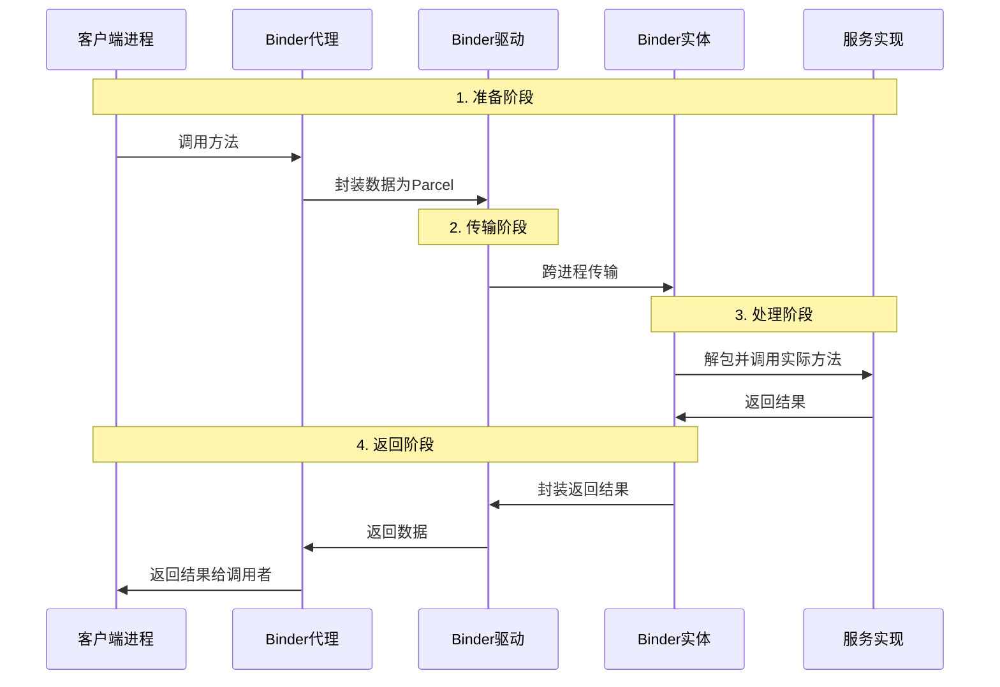

# Binder

- 进程间通信

## 一、Binder 的本质理解

### 1. 简单比喻

**Binder 就像 Android 系统中的"快递公司"**：

```markdown
发送方应用（进程A） —— 快递员（Binder驱动） —— 接收方应用（进程B）
    ↓                               ↓                         ↓
  打包数据（Parcel）         中转站（内核空间）          拆包处理
```

### 2. 技术定义

Binder 是 Android 独有的 IPC 机制，基于**内核驱动**实现，提供：

- 

  高效的进程间通信

- 

  完善的引用计数

- 

  严格的安全检查

- 

  自动的死亡通知

## 二、为什么 Android 需要 Binder？

### 传统 Linux IPC 机制的问题

| IPC 方式     | 问题                 | 原因                    |
| ------------ | -------------------- | ----------------------- |
| **管道**     | 单向，只能父子进程   | 不适合 Android 复杂通信 |
| **消息队列** | 数据复制两次，效率低 | 性能差                  |
| **共享内存** | 需要同步，不安全     | 容易死锁，不安全        |
| **Socket**   | 开销大，复杂         | 不适合大量本地 IPC      |

### Binder 的优势

```java
// 1. 一次拷贝（性能关键）
// 传统IPC：用户空间 → 内核空间 → 用户空间（两次拷贝）
// Binder：用户空间 → 内核空间（一次拷贝，通过内存映射）

// 2. 引用计数（避免内存泄漏）
// 自动管理Binder对象的生命周期

// 3. 安全性（基于Linux UID/PID）
// 验证调用方身份，防止恶意攻击

// 4. 线程管理
// 自动创建和管理线程池
```

## 三、Binder 架构设计

### 1. 整体架构

```mermaid
graph TB
    subgraph "客户端进程"
        A[客户端应用] --> B[Binder代理 Proxy]
    end
    
    subgraph "内核空间"
        B --> C[Binder驱动]
    end
    
    subgraph "服务端进程"
        C --> D[Binder实体 Stub]
        D --> E[服务端实现]
    end
    
    B -- 调用 -->|Binder事务| C
    C -- 分发 -->|Binder事务| D
```

生成失败，换个方式问问吧

### 2. 四大核心组件

```markdown
1. 客户端应用 (Client)
   ↓
2. Binder代理 (Proxy) - 客户端的"代言人"
   ↓
3. Binder驱动 (Driver) - 内核中的"交通枢纽"
   ↓
4. Binder实体 (Stub) - 服务端的"接待员"
   ↓
5. 服务端实现 (Service Implementation)
```

## 四、Binder 的核心实现原理

### 1. 一次拷贝的奥秘

```c
// Binder驱动通过内存映射实现
struct binder_buffer {
    void *data;         // 数据区
    size_t data_size;   // 数据大小
    // ...
};

// 内存映射过程
1. 发送方: 数据拷贝到发送缓存区
2. Binder驱动: 映射接收方内存到同一物理页
3. 接收方: 直接访问数据，无需二次拷贝
```

**示意图**：

```markdown
进程A用户空间     内核空间        进程B用户空间
     ↓               ↓               ↓
[数据拷贝] ---> [Binder缓存区] ---> [内存映射]
  (1次)                              (0次)
```

### 2. 引用计数机制

```java
// Binder自动管理对象生命周期
class Binder {
    int weakRefs;    // 弱引用计数
    int strongRefs;  // 强引用计数
    int handle;      // 对象句柄
    
    // 当引用计数为0时，自动销毁
    void decStrong(handle) {
        if (--strongRefs == 0) {
            destroyBinder(handle);
        }
    }
}
```

## 五、Binder 通信流程详解

### 完整通信序列



### 代码层面的调用链

```java
// 1. 客户端调用
// MyServiceProxy.java (自动生成)
public int calculate(int a, int b) {
    // 准备数据
    Parcel data = Parcel.obtain();
    Parcel reply = Parcel.obtain();
    data.writeInt(a);
    data.writeInt(b);
    
    // 远程调用
    mRemote.transact(TRANSACTION_calculate, data, reply, 0);
    
    // 读取结果
    int result = reply.readInt();
    data.recycle();
    reply.recycle();
    return result;
}

// 2. Binder驱动传输
// binder.c (内核驱动)
static long binder_ioctl(struct file *filp, unsigned int cmd, unsigned long arg) {
    switch (cmd) {
        case BINDER_WRITE_READ:
            // 处理读写请求
            binder_thread_write(proc, thread, ptr, size);
            binder_thread_read(proc, thread, ptr, size);
            break;
    }
}

// 3. 服务端处理
// MyServiceStub.java (自动生成)
protected boolean onTransact(int code, Parcel data, Parcel reply, int flags) {
    switch (code) {
        case TRANSACTION_calculate:
            int a = data.readInt();
            int b = data.readInt();
            int result = calculate(a, b);  // 调用实际实现
            reply.writeInt(result);
            return true;
    }
}
```

## 六、Binder 在 Android 系统中的广泛应用

### 1. 系统服务架构

```java
// Android 系统服务都基于 Binder
SystemServiceManager
    ├── ActivityManagerService (AMS)    // 管理Activity
    ├── WindowManagerService (WMS)      // 管理窗口
    ├── PackageManagerService (PMS)     // 管理应用安装
    ├── NotificationManagerService (NMS) // 管理通知
    ├── PowerManagerService (PMS)       // 电源管理
    ├── LocationManagerService (LMS)    // 定位服务
    └── ... 30+ 个系统服务
```

### 2. 获取系统服务示例

```java
// 通过 Binder 获取系统服务
public class SystemServiceExample {
    
    // 获取 ActivityManager
    ActivityManager am = (ActivityManager) 
        context.getSystemService(Context.ACTIVITY_SERVICE);
    
    // 获取 WindowManager
    WindowManager wm = (WindowManager)
        context.getSystemService(Context.WINDOW_SERVICE);
    
    // 实际调用链
    // getSystemService() → ServiceManager → Binder → 系统服务
}
```

