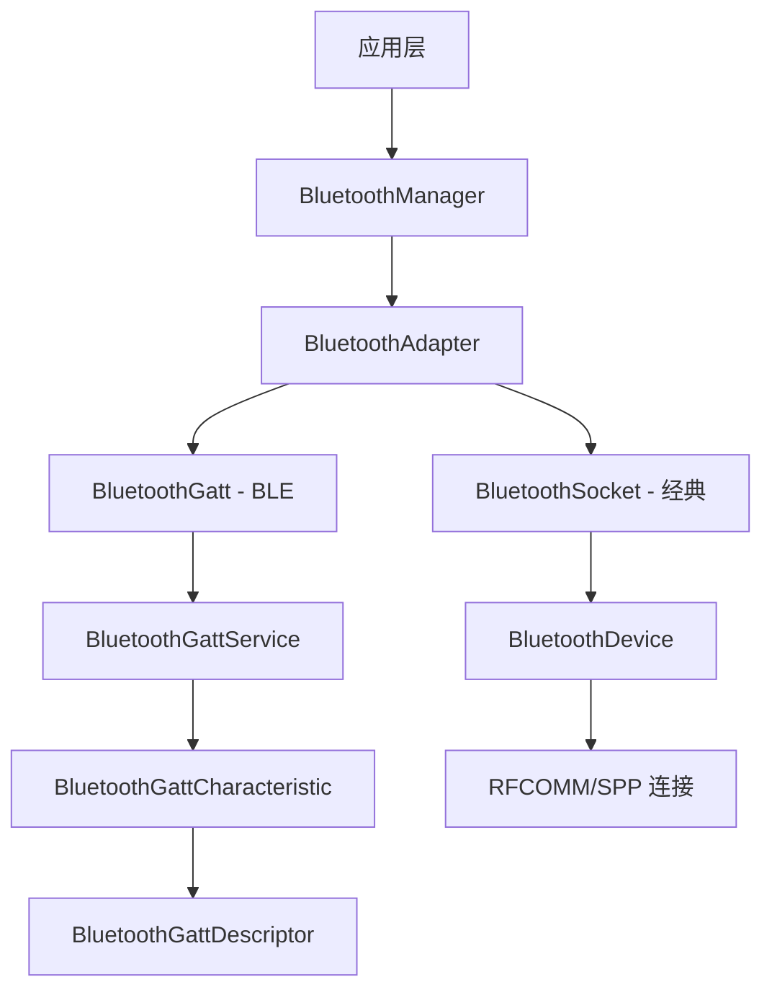
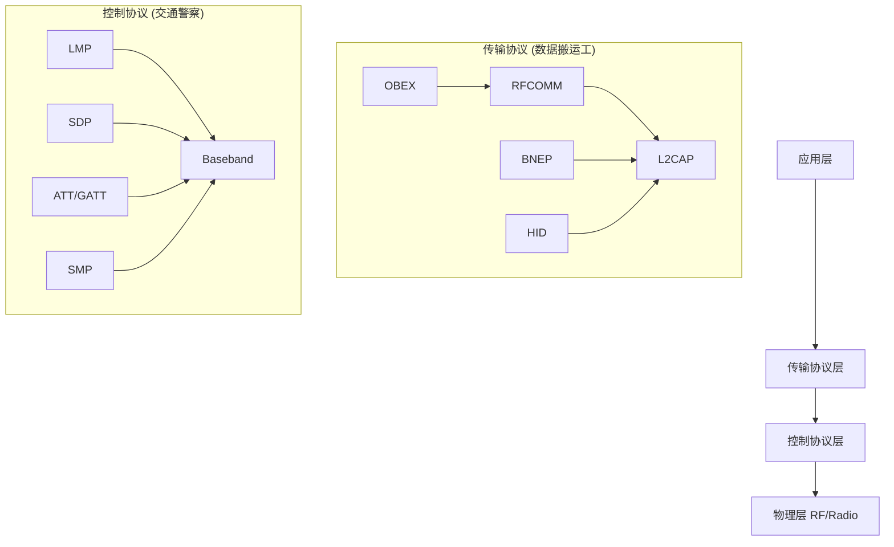

# BluetoothManager 

# Android BluetoothManager 详解

`BluetoothManager`是 Android 4.3（API 18）引入的蓝牙管理类，它是 Android 蓝牙框架的核心入口点。让我为您详细解析这个重要的系统服务。

## 📋 核心功能概览

`BluetoothManager`主要负责：

1. 

   **获取系统蓝牙服务实例**

2. 

   **管理多个蓝牙适配器**

3. 

   **创建 GATT 客户端/服务端**

4. 

   **管理 LE 扫描**

5. 

   **提供蓝牙状态监控**

## 🏗️ BluetoothManager 在 Android 蓝牙架构中的位置




    




## 🔧 如何获取 BluetoothManager

### 标准获取方式

```kotlin
// 1. 通过系统服务获取（推荐）
val bluetoothManager = context.getSystemService(Context.BLUETOOTH_SERVICE) as BluetoothManager

// 2. 或者使用 BluetoothManagerCompat（需要 androidx.core:core-ktx）
val bluetoothManager = context.getSystemService(BluetoothManager::class.java)

// 3. 获取默认的 BluetoothAdapter
val bluetoothAdapter = bluetoothManager.adapter
```

### 兼容性检查

```kotlin
fun getBluetoothManager(context: Context): BluetoothManager? {
    return if (Build.VERSION.SDK_INT >= Build.VERSION_CODES.JELLY_BEAN_MR2) {
        context.getSystemService(Context.BLUETOOTH_SERVICE) as? BluetoothManager
    } else {
        // API 18 以下不支持 BluetoothManager
        // 需要使用传统方式：BluetoothAdapter.getDefaultAdapter()
        null
    }
}
```

## 📊 BluetoothManager 的主要功能

### 1. 管理 BluetoothAdapter

```kotlin
class BluetoothController(private val context: Context) {
    
    private val bluetoothManager: BluetoothManager by lazy {
        context.getSystemService(Context.BLUETOOTH_SERVICE) as BluetoothManager
    }
    
    // 获取默认蓝牙适配器
    val bluetoothAdapter: BluetoothAdapter?
        get() = bluetoothManager.adapter
    
    // 检查蓝牙是否可用
    fun isBluetoothAvailable(): Boolean {
        return bluetoothAdapter?.isEnabled == true
    }
    
    // 获取已绑定的设备
    fun getBondedDevices(): Set<BluetoothDevice> {
        return bluetoothAdapter?.bondedDevices ?: emptySet()
    }
    
    // 获取已连接的设备
    fun getConnectedDevices(): List<BluetoothDevice> {
        return bluetoothAdapter?.getConnectedDevices(BluetoothProfile.GATT) ?: emptyList()
    }
}
```

### 2. 管理多个蓝牙适配器（Android 12+）

```kotlin
@RequiresApi(Build.VERSION_CODES.S)
class MultiAdapterManager(context: Context) {
    
    private val bluetoothManager = context.getSystemService(BluetoothManager::class.java)
    
    // 获取所有可用的蓝牙适配器
    fun getAllAdapters(): List<BluetoothAdapter> {
        return bluetoothManager.adapter?.let { defaultAdapter ->
            listOf(defaultAdapter) + bluetoothManager.getAdapters()
        } ?: emptyList()
    }
    
    // 获取特定位置的适配器
    fun getAdapterAt(slot: Int): BluetoothAdapter? {
        return if (slot == 0) {
            bluetoothManager.adapter
        } else {
            bluetoothManager.getAdapters().getOrNull(slot - 1)
        }
    }
    
    // 使用特定适配器进行扫描
    fun startLeScanWithAdapter(
        adapter: BluetoothAdapter,
        scanCallback: ScanCallback
    ) {
        val scanner = adapter.bluetoothLeScanner
        val scanSettings = ScanSettings.Builder()
            .setScanMode(ScanSettings.SCAN_MODE_LOW_LATENCY)
            .build()
        
        scanner.startScan(null, scanSettings, scanCallback)
    }
}
```

### 3. 创建和管理 GATT 连接（BLE）

```kotlin
class BleDeviceManager(
    private val context: Context,
    private val deviceAddress: String
) {
    
    private val bluetoothManager = context.getSystemService(Context.BLUETOOTH_SERVICE) as BluetoothManager
    private var bluetoothGatt: BluetoothGatt? = null
    
    // 连接 BLE 设备
    fun connect(): Boolean {
        val bluetoothAdapter = bluetoothManager.adapter ?: return false
        val device = bluetoothAdapter.getRemoteDevice(deviceAddress) ?: return false
        
        // 连接 GATT 服务（支持自动重连）
        bluetoothGatt = device.connectGatt(
            context,
            false,  // autoConnect
            gattCallback,
            BluetoothDevice.TRANSPORT_LE  // 使用 LE 传输
        )
        
        return bluetoothGatt != null
    }
    
    // GATT 回调
    private val gattCallback = object : BluetoothGattCallback() {
        override fun onConnectionStateChange(gatt: BluetoothGatt, status: Int, newState: Int) {
            when (newState) {
                BluetoothProfile.STATE_CONNECTED -> {
                    // 连接成功，发现服务
                    gatt.discoverServices()
                }
                BluetoothProfile.STATE_DISCONNECTED -> {
                    // 连接断开
                    disconnect()
                }
            }
        }
        
        override fun onServicesDiscovered(gatt: BluetoothGatt, status: Int) {
            if (status == BluetoothGatt.GATT_SUCCESS) {
                // 服务发现成功
                handleServices(gatt.services)
            }
        }
    }
    
    // 断开连接
    fun disconnect() {
        bluetoothGatt?.disconnect()
        bluetoothGatt?.close()
        bluetoothGatt = null
    }
    
    // 获取连接状态
    fun getConnectionState(): Int {
        return bluetoothManager.getConnectionState(
            bluetoothAdapter?.getRemoteDevice(deviceAddress),
            BluetoothProfile.GATT
        )
    }
}
```

### 4. LE 扫描管理

```kotlin
class BleScanner(private val context: Context) {
    
    private val bluetoothManager = context.getSystemService(Context.BLUETOOTH_SERVICE) as BluetoothManager
    private val bluetoothAdapter = bluetoothManager.adapter
    private var bluetoothLeScanner: BluetoothLeScanner? = null
    private var scanning = false
    
    // 开始扫描
    fun startScan(scanCallback: ScanCallback) {
        bluetoothAdapter?.bluetoothLeScanner?.let { scanner ->
            if (!scanning) {
                bluetoothLeScanner = scanner
                
                val filters = mutableListOf<ScanFilter>().apply {
                    // 添加扫描过滤器（可选）
                    add(ScanFilter.Builder()
                        .setServiceUuid(ParcelUuid(SERVICE_UUID))
                        .build())
                }
                
                val scanSettings = ScanSettings.Builder()
                    .setScanMode(ScanSettings.SCAN_MODE_LOW_LATENCY)
                    .setReportDelay(0)  // 立即报告结果
                    .build()
                
                scanner.startScan(filters, scanSettings, scanCallback)
                scanning = true
            }
        }
    }
    
    // 停止扫描
    fun stopScan(scanCallback: ScanCallback) {
        bluetoothLeScanner?.stopScan(scanCallback)
        scanning = false
    }
    
    // 检查扫描状态
    fun isScanning(): Boolean {
        return scanning
    }
    
    companion object {
        private val SERVICE_UUID = UUID.fromString("0000ffe0-0000-1000-8000-00805f9b34fb")
    }
}
```

## 🛡️ 权限与配置

### 必需权限

```xml
<!-- AndroidManifest.xml -->
<uses-permission android:name="android.permission.BLUETOOTH" />
<uses-permission android:name="android.permission.BLUETOOTH_ADMIN" />

<!-- BLE 需要额外权限 -->
<uses-permission android:name="android.permission.BLUETOOTH_SCAN" />
<uses-permission android:name="android.permission.BLUETOOTH_CONNECT" />
<uses-permission android:name="android.permission.BLUETOOTH_ADVERTISE" />

<!-- Android 12+ 需要精确位置权限用于扫描 -->
<uses-permission android:name="android.permission.ACCESS_FINE_LOCATION" />
<uses-permission android:name="android.permission.ACCESS_COARSE_LOCATION" />

<!-- 可选的硬件特性声明 -->
<uses-feature android:name="android.hardware.bluetooth" android:required="true" />
<uses-feature android:name="android.hardware.bluetooth_le" android:required="true" />
```

### 运行时权限请求

```kotlin
class BluetoothPermissionHelper(private val activity: FragmentActivity) {
    
    companion object {
        // Android 12+ 需要的权限
        @RequiresApi(Build.VERSION_CODES.S)
        val BLUETOOTH_PERMISSIONS_31 = arrayOf(
            Manifest.permission.BLUETOOTH_SCAN,
            Manifest.permission.BLUETOOTH_CONNECT,
            Manifest.permission.ACCESS_FINE_LOCATION
        )
        
        // Android 6-11 需要的权限
        val BLUETOOTH_PERMISSIONS_LEGACY = arrayOf(
            Manifest.permission.ACCESS_FINE_LOCATION,
            Manifest.permission.ACCESS_COARSE_LOCATION
        )
    }
    
    fun requestPermissions() {
        val permissions = if (Build.VERSION.SDK_INT >= Build.VERSION_CODES.S) {
            BLUETOOTH_PERMISSIONS_31
        } else {
            BLUETOOTH_PERMISSIONS_LEGACY
        }
        
        ActivityCompat.requestPermissions(
            activity,
            permissions,
            REQUEST_CODE_BLUETOOTH
        )
    }
    
    fun checkPermissions(): Boolean {
        val permissions = if (Build.VERSION.SDK_INT >= Build.VERSION_CODES.S) {
            BLUETOOTH_PERMISSIONS_31
        } else {
            BLUETOOTH_PERMISSIONS_LEGACY
        }
        
        return permissions.all { permission ->
            ContextCompat.checkSelfPermission(activity, permission) == 
                PackageManager.PERMISSION_GRANTED
        }
    }
}
```

## 🔄 生命周期管理

### Activity/Fragment 中的蓝牙管理

```kotlin
class BluetoothFragment : Fragment(), BluetoothAdapter.LeScanCallback {
    
    private lateinit var bluetoothManager: BluetoothManager
    private lateinit var bluetoothAdapter: BluetoothAdapter
    private var scanning = false
    
    override fun onCreate(savedInstanceState: Bundle?) {
        super.onCreate(savedInstanceState)
        
        // 初始化 BluetoothManager
        bluetoothManager = requireContext()
            .getSystemService(Context.BLUETOOTH_SERVICE) as BluetoothManager
        bluetoothAdapter = bluetoothManager.adapter ?: run {
            // 设备不支持蓝牙
            Toast.makeText(requireContext(), "设备不支持蓝牙", Toast.LENGTH_SHORT).show()
            requireActivity().finish()
            return
        }
        
        // 检查蓝牙是否开启
        if (!bluetoothAdapter.isEnabled) {
            val enableBtIntent = Intent(BluetoothAdapter.ACTION_REQUEST_ENABLE)
            startActivityForResult(enableBtIntent, REQUEST_ENABLE_BT)
        }
    }
    
    override fun onResume() {
        super.onResume()
        
        // 注册广播接收器
        registerBluetoothReceiver()
        
        // 开始扫描（如果有权限）
        if (hasPermissions()) {
            startScan()
        }
    }
    
    override fun onPause() {
        super.onPause()
        
        // 停止扫描
        stopScan()
        
        // 注销广播接收器
        unregisterBluetoothReceiver()
    }
    
    override fun onDestroy() {
        super.onDestroy()
        
        // 清理资源
        bluetoothAdapter.cancelDiscovery()
    }
    
    private fun registerBluetoothReceiver() {
        val filter = IntentFilter().apply {
            addAction(BluetoothAdapter.ACTION_STATE_CHANGED)
            addAction(BluetoothDevice.ACTION_FOUND)
            addAction(BluetoothDevice.ACTION_BOND_STATE_CHANGED)
            addAction(BluetoothAdapter.ACTION_DISCOVERY_STARTED)
            addAction(BluetoothAdapter.ACTION_DISCOVERY_FINISHED)
        }
        
        requireContext().registerReceiver(bluetoothReceiver, filter)
    }
    
    private val bluetoothReceiver = object : BroadcastReceiver() {
        override fun onReceive(context: Context, intent: Intent) {
            when (intent.action) {
                BluetoothAdapter.ACTION_STATE_CHANGED -> {
                    val state = intent.getIntExtra(
                        BluetoothAdapter.EXTRA_STATE, 
                        BluetoothAdapter.ERROR
                    )
                    when (state) {
                        BluetoothAdapter.STATE_ON -> {
                            // 蓝牙已开启
                            onBluetoothEnabled()
                        }
                        BluetoothAdapter.STATE_OFF -> {
                            // 蓝牙已关闭
                            onBluetoothDisabled()
                        }
                    }
                }
                BluetoothDevice.ACTION_FOUND -> {
                    val device: BluetoothDevice? = intent.getParcelableExtra(
                        BluetoothDevice.EXTRA_DEVICE
                    )
                    device?.let { onDeviceFound(it) }
                }
            }
        }
    }
}
```

## 📡 广播接收器示例

### 监听蓝牙状态变化

```kotlin
class BluetoothStateMonitor : BroadcastReceiver() {
    
    interface Listener {
        fun onBluetoothStateChanged(enabled: Boolean)
        fun onDeviceConnected(device: BluetoothDevice)
        fun onDeviceDisconnected(device: BluetoothDevice)
        fun onDeviceBondStateChanged(device: BluetoothDevice, state: Int)
    }
    
    private var listener: Listener? = null
    
    fun setListener(listener: Listener) {
        this.listener = listener
    }
    
    override fun onReceive(context: Context, intent: Intent) {
        when (intent.action) {
            BluetoothAdapter.ACTION_STATE_CHANGED -> {
                val state = intent.getIntExtra(
                    BluetoothAdapter.EXTRA_STATE,
                    BluetoothAdapter.ERROR
                )
                val enabled = state == BluetoothAdapter.STATE_ON
                listener?.onBluetoothStateChanged(enabled)
            }
            
            BluetoothDevice.ACTION_ACL_CONNECTED -> {
                val device = intent.getParcelableExtra<BluetoothDevice>(
                    BluetoothDevice.EXTRA_DEVICE
                )
                device?.let { listener?.onDeviceConnected(it) }
            }
            
            BluetoothDevice.ACTION_ACL_DISCONNECTED -> {
                val device = intent.getParcelableExtra<BluetoothDevice>(
                    BluetoothDevice.EXTRA_DEVICE
                )
                device?.let { listener?.onDeviceDisconnected(it) }
            }
            
            BluetoothDevice.ACTION_BOND_STATE_CHANGED -> {
                val device = intent.getParcelableExtra<BluetoothDevice>(
                    BluetoothDevice.EXTRA_DEVICE
                )
                val state = intent.getIntExtra(
                    BluetoothDevice.EXTRA_BOND_STATE,
                    BluetoothDevice.ERROR
                )
                device?.let { listener?.onDeviceBondStateChanged(it, state) }
            }
        }
    }
    
    companion object {
        fun getIntentFilter(): IntentFilter {
            return IntentFilter().apply {
                addAction(BluetoothAdapter.ACTION_STATE_CHANGED)
                addAction(BluetoothDevice.ACTION_ACL_CONNECTED)
                addAction(BluetoothDevice.ACTION_ACL_DISCONNECTED)
                addAction(BluetoothDevice.ACTION_BOND_STATE_CHANGED)
            }
        }
    }
}
```

## 🔧 实用工具类

### BluetoothManager 封装类

```kotlin
class BluetoothHelper(private val context: Context) {
    
    private val bluetoothManager: BluetoothManager by lazy {
        context.getSystemService(Context.BLUETOOTH_SERVICE) as BluetoothManager
    }
    
    private val bluetoothAdapter: BluetoothAdapter?
        get() = bluetoothManager.adapter
    
    // 检查蓝牙支持
    fun isBluetoothSupported(): Boolean {
        return bluetoothAdapter != null
    }
    
    // 检查蓝牙是否启用
    fun isBluetoothEnabled(): Boolean {
        return bluetoothAdapter?.isEnabled == true
    }
    
    // 启用蓝牙（需要用户确认）
    fun enableBluetooth(activity: Activity, requestCode: Int) {
        if (!isBluetoothEnabled()) {
            val enableBtIntent = Intent(BluetoothAdapter.ACTION_REQUEST_ENABLE)
            activity.startActivityForResult(enableBtIntent, requestCode)
        }
    }
    
    // 获取已配对的设备
    fun getPairedDevices(): List<BluetoothDevice> {
        return bluetoothAdapter?.bondedDevices?.toList() ?: emptyList()
    }
    
    // 获取已连接的设备
    fun getConnectedDevices(profile: Int = BluetoothProfile.GATT): List<BluetoothDevice> {
        return bluetoothAdapter?.getConnectedDevices(profile) ?: emptyList()
    }
    
    // 开始发现设备
    fun startDiscovery(): Boolean {
        return bluetoothAdapter?.startDiscovery() ?: false
    }
    
    // 取消发现
    fun cancelDiscovery() {
        bluetoothAdapter?.cancelDiscovery()
    }
    
    // 获取蓝牙状态
    fun getBluetoothState(): Int {
        return bluetoothAdapter?.state ?: BluetoothAdapter.ERROR
    }
    
    // 获取本地设备信息
    fun getLocalDeviceInfo(): BluetoothDevice? {
        return bluetoothAdapter?.getRemoteDevice(bluetoothAdapter.address)
    }
    
    // 通过地址获取设备
    fun getDeviceByAddress(address: String): BluetoothDevice? {
        return try {
            bluetoothAdapter?.getRemoteDevice(address)
        } catch (e: IllegalArgumentException) {
            null
        }
    }
    
    // 检查是否正在扫描
    fun isDiscovering(): Boolean {
        return bluetoothAdapter?.isDiscovering ?: false
    }
}
```