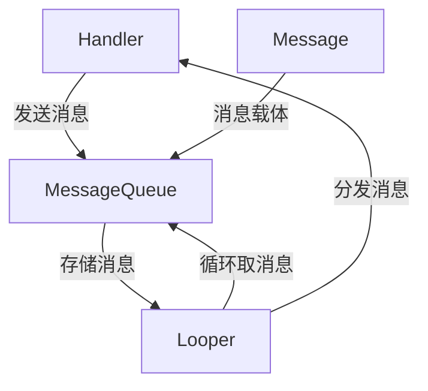
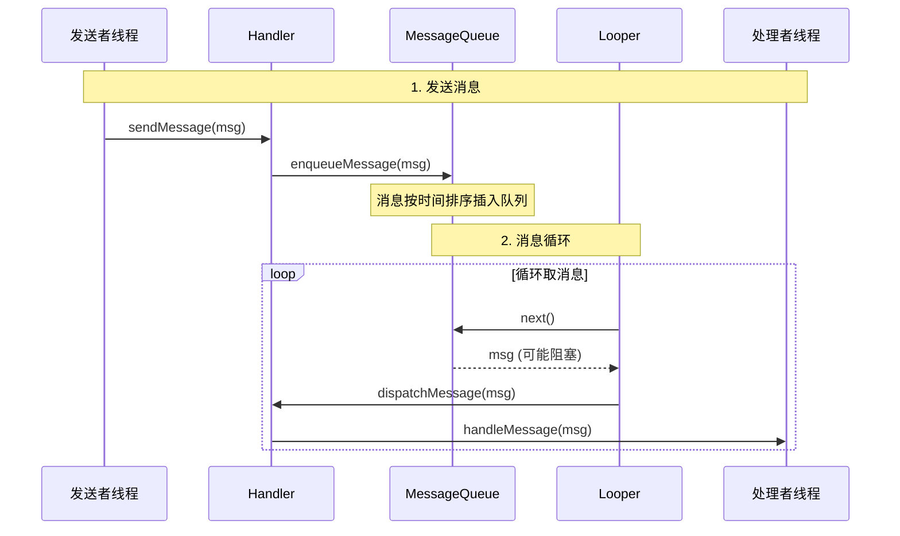

# Handler 和 Looper

> [Android Looper和Handler - tt_mc - 博客园](https://www.cnblogs.com/tt_mc/archive/2012/01/30/2331876.html)
>
> 

- **线程间通信**
- **消息处理**

## 一、Handler 机制的四个核心组件



**四个核心组件的关系**：

- **Handler**：消息的发送者和处理者
- **MessageQueue**：消息队列，存放待处理的消息
- **Looper**：消息循环，不断从队列中取消息
- **Message**：消息载体，包含数据和目标 Handler

## 二、核心组件详解

### 1. Message（消息）

```java
// Message 的结构
public final class Message implements Parcelable {
    public int what;          // 消息标识
    public int arg1;          // 整型参数1
    public int arg2;          // 整型参数2
    public Object obj;        // 任意对象
    public Bundle data;       // 数据包
    public Handler target;    // 目标Handler
    public Runnable callback; // Runnable回调
    
    // 消息回收（使用对象池优化）
    public void recycle() { /*...*/ }
    
    // 从对象池获取（避免频繁创建对象）
    public static Message obtain() { /*...*/ }
}
```

**Message 对象池**：

```java
// 获取 Message 的最佳实践
Message msg = Message.obtain();  // 从对象池获取，复用对象
msg.what = MSG_TYPE_1;
msg.obj = data;
handler.sendMessage(msg);

// ❌ 错误做法：每次都 new Message()
// ✅ 正确做法：使用 Message.obtain() 或 handler.obtainMessage()
```

### 2. MessageQueue（消息队列）

```java
// 内部数据结构：单链表
Message mMessages;  // 链表头

// 关键方法
boolean enqueueMessage(Message msg, long when) {
    // 按执行时间 when 排序插入链表
    // 返回 true 表示插入成功
}

Message next() {
    // 获取下一条消息（可能阻塞）
    // 如果没有消息，线程会进入休眠
}
```

**消息队列特性**：

- 

  **有序性**：按执行时间 `when`排序

- 

  **阻塞性**：没有消息时线程休眠

- 

  **同步屏障**：可以插入同步屏障，优先处理异步消息

- 

  **空闲Handler**：队列空闲时执行的回调

### 3. Looper（循环器）

```java
// Looper 的核心结构
public final class Looper {
    static final ThreadLocal<Looper> sThreadLocal = new ThreadLocal<>();
    final MessageQueue mQueue;  // 关联的消息队列
    final Thread mThread;       // 所属线程
    
    // 核心循环方法
    public static void loop() {
        final Looper me = myLooper();
        final MessageQueue queue = me.mQueue;
        
        for (;;) {  // 无限循环
            Message msg = queue.next();  // 可能阻塞
            if (msg == null) {
                return;  // 消息队列退出
            }
            
            // 分发消息给Handler
            msg.target.dispatchMessage(msg);
            msg.recycleUnchecked();  // 回收消息
        }
    }
}
```

**Looper 的创建**：

```java
// 主线程 Looper（系统自动创建）
// 在 ActivityThread.main() 中调用 Looper.prepareMainLooper()

// 子线程创建 Looper
class MyThread extends Thread {
    private Handler mHandler;
    
    @Override
    public void run() {
        Looper.prepare();  // 创建 Looper
        mHandler = new Handler() {
            @Override
            public void handleMessage(Message msg) {
                // 处理消息
            }
        };
        Looper.loop();  // 开始消息循环
    }
    
    public void quit() {
        Looper.myLooper().quit();  // 退出循环
    }
}
```

### 4. Handler（处理器）

```java
// Handler 的核心职责
public class Handler {
    final Looper mLooper;       // 关联的 Looper
    final MessageQueue mQueue;  // 消息队列
    final Callback mCallback;   // 回调接口
    
    // 发送消息
    public final boolean sendMessage(Message msg) {
        return sendMessageDelayed(msg, 0);
    }
    
    // 分发消息
    public void dispatchMessage(Message msg) {
        if (msg.callback != null) {
            // 处理 Runnable
            handleCallback(msg);
        } else {
            if (mCallback != null) {
                // 先尝试 Callback
                if (mCallback.handleMessage(msg)) {
                    return;
                }
            }
            // 最后调用 handleMessage
            handleMessage(msg);
        }
    }
    
    // 处理消息（子类重写）
    public void handleMessage(Message msg) { }
}
```

## 三、Handler 的工作流程

### 完整流程示意图



### 代码执行流程

```java
// 1. 发送消息
handler.sendMessage(msg);
↓
// 2. 入队
msg.target = this;  // 设置目标Handler
mQueue.enqueueMessage(msg, when);
↓
// 3. 消息循环（Looper线程）
msg = queue.next();  // 可能阻塞
↓
// 4. 分发
msg.target.dispatchMessage(msg);
↓
// 5. 处理
if (msg.callback != null) {
    msg.callback.run();  // 执行Runnable
} else if (mCallback != null) {
    mCallback.handleMessage(msg);  // 回调接口
} else {
    handleMessage(msg);  // Handler自身处理
}
```

## 四、Handler 的三种使用方式

### 1. 继承 Handler

```java
class MyHandler extends Handler {
    @Override
    public void handleMessage(Message msg) {
        switch (msg.what) {
            case MSG_UPDATE_UI:
                updateUI(msg.obj);
                break;
        }
    }
}

// 使用
Handler handler = new MyHandler();
handler.sendEmptyMessage(MSG_UPDATE_UI);
```

### 2. 实现 Callback 接口

```java
Handler.Callback callback = new Handler.Callback() {
    @Override
    public boolean handleMessage(Message msg) {
        // 返回 true 表示已处理，不再调用 Handler.handleMessage
        return false;
    }
};

Handler handler = new Handler(callback);
```

### 3. 使用 Runnable

```java
// 方式1：post Runnable
handler.post(new Runnable() {
    @Override
    public void run() {
        // 在Handler所在线程执行
    }
});

// 方式2：postDelayed
handler.postDelayed(() -> {
    // 延迟执行
}, 1000);

// 方式3：postAtTime
handler.postAtTime(() -> {
    // 在指定时间执行
}, SystemClock.uptimeMillis() + 5000);
```
