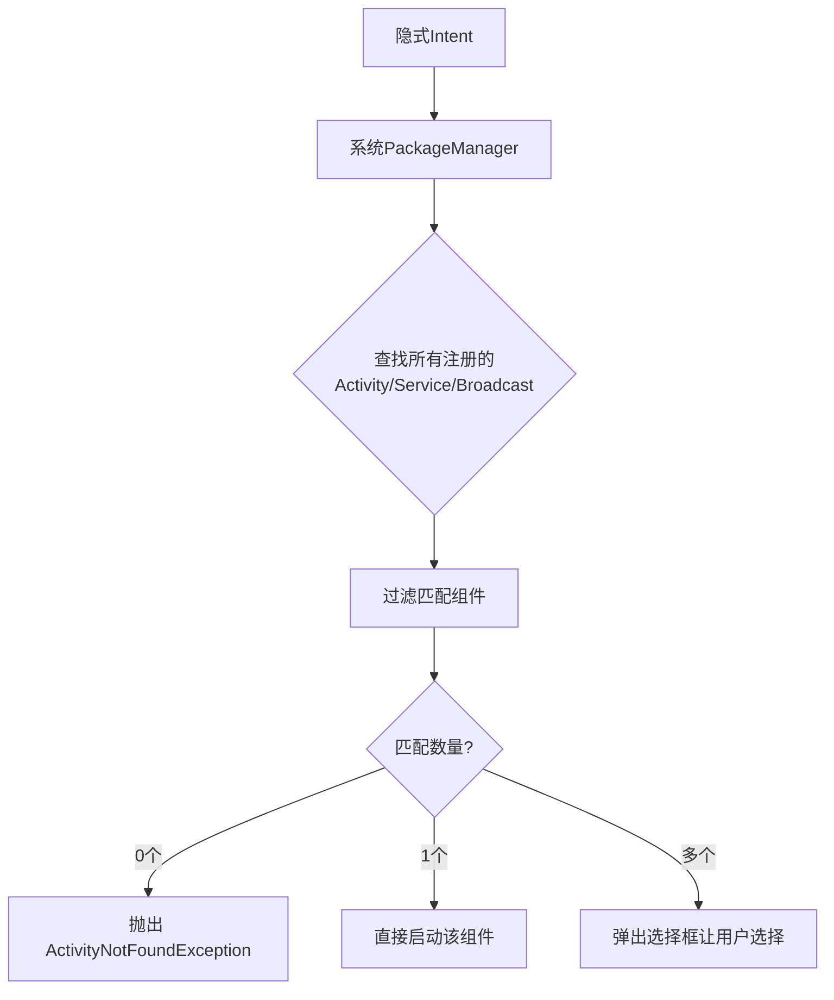

# 隐式 Intent 与显式 Intent

## 一、两种 Intent 的核心区别

### 1. **代码对比**

```java
// 1. 隐式 Intent（您提供的代码）
Intent intent = new Intent("android.settings.APPLICATION_DETAILS_SETTINGS");
startActivity(intent);

// 2. 显式 Intent（明确指定目标 Activity）
Intent intent = new Intent(this, SettingsActivity.class);
startActivity(intent);
```

### 2. **本质区别**

| 特性         | 隐式 Intent                | 显式 Intent                     |
| ------------ | -------------------------- | ------------------------------- |
| **指定目标** | 只指定**做什么**（action） | 明确指定**谁来做**（Component） |
| **匹配机制** | 系统匹配符合条件的组件     | 直接启动指定组件                |
| **灵活性**   | 高，可以由多个组件响应     | 低，只能启动指定组件            |
| **使用场景** | 跨应用调用、系统功能       | 应用内部页面跳转                |
| **匹配结果** | 可能弹出选择框             | 直接跳转                        |

## 二、隐式 Intent 详解

### 1. **隐式 Intent 的工作机制**

```java
// 隐式 Intent 的完整结构
Intent intent = new Intent();
intent.setAction("android.settings.APPLICATION_DETAILS_SETTINGS");  // 动作
intent.addCategory(Intent.CATEGORY_DEFAULT);                        // 类别
intent.setData(Uri.parse("package:com.example.app"));               // 数据
intent.setType("text/plain");                                       // 数据类型
intent.addFlags(Intent.FLAG_ACTIVITY_NEW_TASK);                     // 标志

// 系统查找匹配的 Activity
List<ResolveInfo> activities = getPackageManager()
    .queryIntentActivities(intent, PackageManager.MATCH_DEFAULT_ONLY);

// 如果有多个匹配，会弹出选择框
```

### 2. **系统如何匹配隐式 Intent**



### 3. **隐式 Intent 的匹配条件**

```xml
<!-- 组件注册时需要声明能处理的 Intent -->
<activity android:name=".MySettingsActivity">
    <intent-filter>
        <!-- 匹配的 Action -->
        <action android:name="android.settings.APPLICATION_DETAILS_SETTINGS" />
        
        <!-- 匹配的 Category（可选） -->
        <category android:name="android.intent.category.DEFAULT" />
        
        <!-- 匹配的 Data（可选） -->
        <data android:scheme="package" />
        
        <!-- 匹配的 MIME Type（可选） -->
        <data android:mimeType="text/plain" />
    </intent-filter>
</activity>
```

## 四、实际应用场景对比

### 1. **场景1：打开系统功能**

```java
// 隐式 Intent - 打开系统功能
// ✅ 正确：不知道具体实现，但知道要做什么
Intent intent = new Intent(Settings.ACTION_WIFI_SETTINGS);
startActivity(intent);

// ❌ 错误：直接启动系统 Activity（厂商可能不同）
// Intent intent = new Intent(this, WifiSettingsActivity.class);
```

### 2. **场景2：应用内部导航**

```java
// 显式 Intent - 应用内部跳转
// ✅ 正确：明确知道要跳转到哪个页面
Intent intent = new Intent(this, ProfileActivity.class);
intent.putExtra("user_id", 123);
startActivity(intent);

// ❌ 错误：用隐式 Intent 内部跳转（效率低，可能被拦截）
// Intent intent = new Intent("com.example.app.PROFILE");
// startActivity(intent);
```

### 3. **场景3：分享功能**

```java
// 隐式 Intent - 分享内容
Intent shareIntent = new Intent(Intent.ACTION_SEND);
shareIntent.setType("text/plain");
shareIntent.putExtra(Intent.EXTRA_TEXT, "分享内容");

// 让用户选择分享方式
startActivity(Intent.createChooser(shareIntent, "分享到"));
```

## 五、技术原理深度解析

### 1. **隐式 Intent 的匹配流程**

```java
public class IntentMatchingProcess {
    
    public void matchIntent(Intent intent) {
        // 1. 获取所有 Activity
        PackageManager pm = getPackageManager();
        List<ResolveInfo> activities = pm.queryIntentActivities(
            intent, 
            PackageManager.MATCH_DEFAULT_ONLY
        );
        
        // 2. 过滤优先级
        activities.sort((a, b) -> {
            // 按 priority 排序
            return Integer.compare(b.priority, a.priority);
        });
        
        // 3. 处理匹配结果
        if (activities.isEmpty()) {
            throw new ActivityNotFoundException("No Activity found to handle " + intent);
        } else if (activities.size() == 1) {
            // 直接启动
            ResolveInfo info = activities.get(0);
            ComponentName component = new ComponentName(
                info.activityInfo.packageName,
                info.activityInfo.name
            );
            intent.setComponent(component);
            startActivity(intent);
        } else {
            // 显示选择器
            showChooser(activities, intent);
        }
    }
}
```

**两种 Intent 的本质区别**：

| 方面     | 显式 Intent    | 隐式 Intent     |
| -------- | -------------- | --------------- |
| **目标** | 知道"要打开谁" | 知道"要做什么"  |
| **关系** | 强依赖具体实现 | 依赖契约/协议   |
| **变化** | 实现变了就崩溃 | 实现变了不影响  |
| **使用** | 内部跳转       | 跨应用/系统调用 |